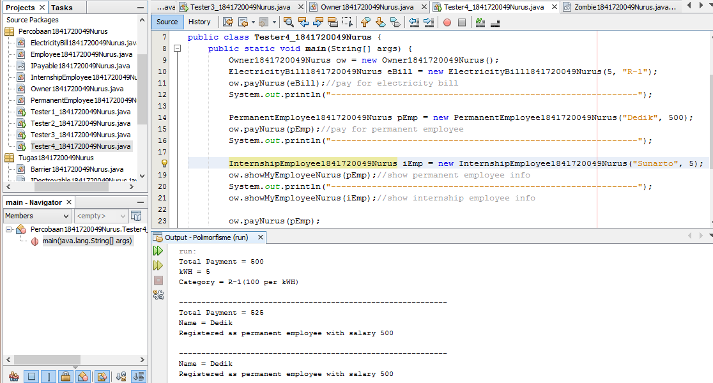

# Laporan Praktikum #10 - Polimorfisme

## Kompetensi

Setelah melakukan percobaan pada jobsheet ini, diharapkan mahasiswa 
mampu:
1.  Memahami konsep dan bentuk dasar polimorfisme
2.  Memahami konsep virtual method invication
3.  Menerapkan polimorfisme pada pembuatan heterogeneous collection
4.  Menerapkan polimorfisme pada parameter/argument method
5.  Menerapkan object casting untuk meng-ubah bentuk objek

## Ringkasan Materi

Polimorfisme merupakan kemampuan suatu objek untuk memiliki banyak bentuk. Penggunaan polimorfisme yang paling umum dalam  OOP terjadi ketika ada referensi super class yang digunakan untuk merujuk ke objek dari sub class. Dengan kata lain, ketika ada suatu objek yang dideklarasikan dari super class, maka objek tersebut bisa diinstansiasi sebagai objek dari sub class. Dari uraian tersebut bisa dilihat bahwa konsep polimorfisme bisa diterapkan pada class-class yang memiliki relasi inheritance  (relasi generalisasi atau IS-A).

##  Praktikum

### Percobaan 1 - Bentuk Dasar Polimorfisme

1. 
2. 
3. 
4. 
5. 
6. 
7. 

link kode program : 

[ini link ke kode program Employee](../../src/10_Polimorfisme/Employee1841720049Nurus.java)

[ini link ke kode program interface payable](../../src/10_Polimorfisme/IPayable1841720049Nurus.java)

[ini link ke kode program internship payable](../../src/10_Polimorfisme/InternshipEmployee1841720049Nurus.java)

[ini link ke kode program permanent employee](../../src/10_Polimorfisme/PermanentEmployee1841720049Nurus.java)

[ini link ke kode program electricity bill](../../src/10_Polimorfisme/ElectricityBill1841720049Nurus.java)

[ini link ke kode program main](../../src/10_Polimorfisme/Tester1_1841720049Nurus.java)

## Pertanyaan :
1.  Class apa sajakah yang merupakan turunan dari class Employee?

Jawab : class internship employee dan class permanent employee

2.  Class apa sajakah yang implements ke interface Payable?

Jawab : class permanent employee dan class electricity bill

3.  Perhatikan class Tester1, baris ke-10 dan 11. Mengapa e, bisa diisi dengan objek pEmp (merupakan objek dari class PermanentEmployee) dan objek iEmp(merupakan objek dari class InternshipEmploye)?

Jawab : dikarenakan class internship employee dan class permanent employee merupakan turunan dari class employee yang di panggil dengan objek e

4.  Perhatikan class Tester1, baris ke-12 dan 13. Mengapa p, bisa diisi dengan objek pEmp (merupakan objek dari class PermanentEmployee) dan objek eBill(merupakan objek dari class ElectricityBill) ?

Jawab : dikarenakan class permanent employee dan class electricity bill merupakan implements dari class interface Payable yang dipanggil dengan objek huruf p

5.  Coba tambahkan sintaks:
p = iEmp;
e = eBill;
Pada baris 14 dan 15 (baris terakhir dalam method main) ! Apa yang menyebabkan error?

Jawab : dikarenakan objek iemp(internship employee) bukan merupakan implements dari payable, begitu juga dengan ebill bukan merupakan turunan dari employee maka dari itu mereka jika dijalankan akan error

6.  Ambil kesimpulan tentang konsep/bentuk dasar polimorfisme!

Jawab : jika kita memanggil objek harus sesuai, harus yang berhubungan antara class extends dengan turunannya dan juga class interface dengan turunannya

### Percobaan 2 - Virtual Method Invocation

1. 

link kode program : 

[ini link ke kode program main](../../src/10_Polimorfisme/Tester2_1841720049Nurus.java)

## Pertanyaan 
1.  Perhatikan class Tester2 di atas,  mengapa pemanggilan e.getEmployeeInfo()  pada baris 8 dan pEmp.getEmployeeInfo() pada baris 10 menghasilkan hasil sama? 

Jawab : dikarenakan objek e = pEmp, jadi bernilai sama dan menghasilkan output yang sama

2.  Mengapa pemanggilan method e.getEmployeeInfo() disebut sebagai pemanggilan method virtual (virtual method invication), sedangkan pEmp.getEmployeeInfo() tidak?

Jawab : karena pemanggilan method e.getEmployeeInfo() merupakan overriding, java bisa mengenali method mana yang dibutuhkan dan method mana yang akan ditampilkan

3.  Jadi apakah yang dimaksud dari virtual method invocation? Mengapa disebut virtual?

Jawab : Virtual method invocation terjadi ketika ada pemanggilan overriding method dari suatu objek polimorfisme. Disebut virtual karena antara method yang dikenali oleh compiler dan method yang dijalankan oleh JVM berbeda.

### Percobaan 3 - Heterogenous Collection

1. 

link kode program : 

[ini link ke kode program main](../../src/10_Polimorfisme/Tester3_1841720049Nurus.java)

## Pertanyaan 

1.  Perhatikan array e pada baris ke-8, mengapa ia bisa diisi dengan objek-objek dengan tipe yang berbeda, yaitu objek pEmp(objek dari PermanentEmployee) dan objek iEmp (objek dari InternshipEmployee) ?

Jawab : dikarenakan objek pEmp dan objek iEmp masih sama-sama merupakan turunan/child dari objek e

2.  Perhatikan juga baris ke-9, mengapa array p juga biisi dengan objek-objek dengan tipe yang berbeda, yaitu objek pEmp (objek dari PermanentEmployee) dan objek eBill (objek dari ElectricityBilling) ?

Jawab : dikarenakan objek pEmp dan objek eBill masih sama-sama merupakan implements dari objek p

3.  Perhatikan baris ke-10, mengapa terjadi error?

Jawab : Dikarenakan objek eBill tidak terdapat pada Employee, maka harusnya diubah menjadi 

### Percobaan 4 - Argumen Polimorfisme, Instanceod dan Casting Object

1. 

link kode program : 

[ini link ke kode program main](../../src/10_Polimorfisme/Tester3_1841720049Nurus.java)

## Pertanyaan
1. Perhatikan class Tester4 baris ke-7  dan baris ke-11, mengapa pemanggilan ow.pay(eBill) dan ow.pay(pEmp) bisa dilakukan, padahal jika diperhatikan method pay() yang ada di dalam class Owner memiliki argument/parameter bertipe Payable? Jika diperhatikan lebih detil eBill merupakan objek dari ElectricityBill dan pEmp merupakan objek dari PermanentEmployee?

Jawab : dikarenakan objek pEmp dan objek eBill merupakan isi dari method pay yang berargument implements Payable dan mereka masih dalam satu implements Payable

2. Jadi apakah tujuan membuat argument bertipe Payable pada method pay() yang ada di dalam class Owner?

Jawab : Tujuannya agar method tersebut bisa menerima nilai argument dari berbagai bentuk objek.

3. Coba pada baris terakhir method main() yang ada di dalam class Tester4 ditambahkan perintah ow.pay(iEmp);

Mengapa terjadi error? 

Jawab : dikarenakan objek iEmp(internship employee) bukan merupakan dari implements Payable dan tidak terdapat pada method pay maka dari itu terjadilah error

4.  Perhatikan class Owner, diperlukan untuk apakah sintaks p instanceof ElectricityBill pada baris ke-6 ?

Jawab : diperlukan untuk mengecek apakah suatu objek p merupakan hasil instansiasi dari class electricityBill

5.  Perhatikan kembali class Owner baris ke-7, untuk apakah casting objek disana (ElectricityBill eb = (ElectricityBill) p) diperlukan ? Mengapa objek p yang bertipe Payable harus di-casting ke dalam objek eb yang bertipe ElectricityBill ?

Jawab : digunakan untuk mengubah tipe dari suatu objek. karena objek p perlu untuk diubah ke dalam objek eb

### Tugas
1. 
2. 
3. 
4. 
5. 
6. 
7. 
8. 
9. 
10. 
11. 

link kode program : 

[ini link ke kode program zombie](../../src/10_Polimorfisme/Zombie1841720049Nurus.java)

[ini link ke kode program interface destroyable](../../src/10_Polimorfisme/IDestroyable1841720049Nurus.java)

[ini link ke kode program barrier](../../src/10_Polimorfisme/Barrier1841720049Nurus.java)

[ini link ke kode program walking zombie](../../src/10_Polimorfisme/WalkingZombie1841720049Nurus.java)

[ini link ke kode program jumping zombie](../../src/10_Polimorfisme/JumpingZombie1841720049Nurus.java)

[ini link ke kode program main](../../src/10_Polimorfisme/Plant1841720049Nurus.java)

## Kesimpulan

Kita dapat mempelajari polimorfisme lebih mendalam dan kita juga dapat mengetahui konsep dan bentuk dasarnya yang terdiri dari virtual method invocation,  polimorfisme argument, operator instanceof serta object casting.

## Pernyataan Diri

Saya menyatakan isi tugas, kode program, dan laporan praktikum ini dibuat oleh saya sendiri. Saya tidak melakukan plagiasi, kecurangan, menyalin/menggandakan milik orang lain.

Jika saya melakukan plagiasi, kecurangan, atau melanggar hak kekayaan intelektual, saya siap untuk mendapat sanksi atau hukuman sesuai peraturan perundang-undangan yang berlaku.

Ttd,

***Nurus Laily Aprillia***