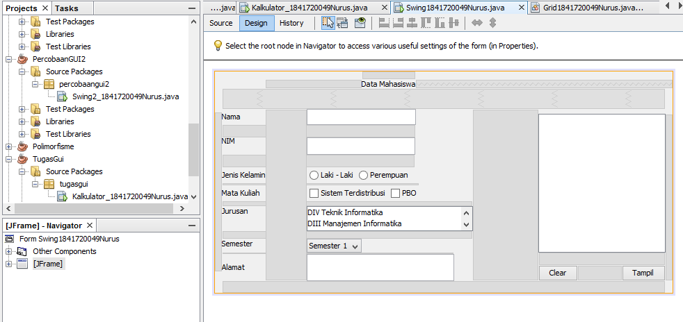
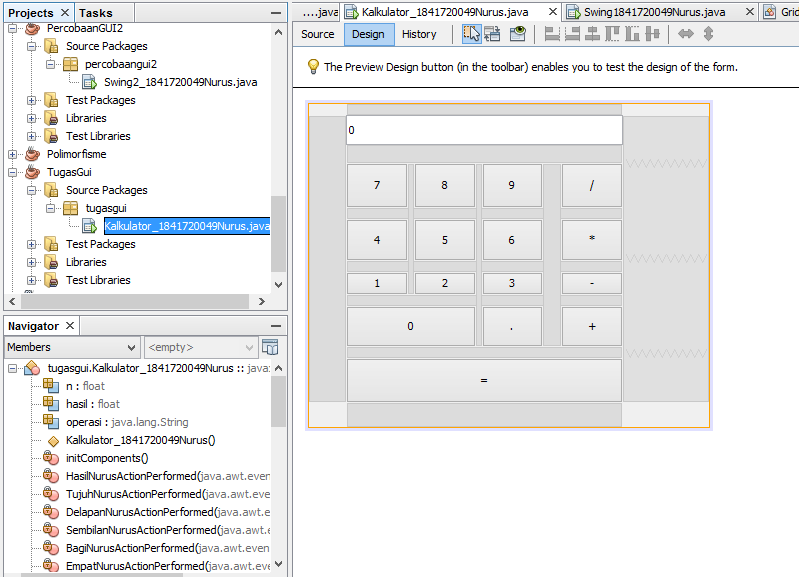

# Laporan Praktikum #11 - GUI (Graphical User Interface)

## Kompetensi

Setelah menyelesaikan lembar kerja ini mahasiswa diharapkan mampu:
1.  Membuat aplikasi Graphical User Interface sederhana dengan bahasa pemrograman java;
2.  Mengenal komponen GUI seperti frame,  label, textfield, combobox, radiobutton, checkbox, 
textarea, menu, serta table;
3.  Menambahkan event handling pada aplikasi GUI.

## Ringkasan Materi

Dalam pemrograman GUI terdapat beberapa bagian yang harus dilakukan yaitu:
1.  Membuat windows utama 
2.  Menentukan komponen-komponen pendukung program 
3.  Menentukan tata letak layout agar nantinya semua komponen –  komponen yang sudah dipersiapkan bisa diaatur sedemikian rupa 
4.  Event Handling dari sebuah aktivitas, seperti penekanan button, check box dan lain-lain

##  Praktikum

### Percobaan 1 - JFrame HelloGUI

1. 

link kode program : 

[ini link ke kode program Hello GUI](../../src/11_GUI/HelloGui1841720049Nurus.java)

### Percobaan 2 - Menangani Input Pada GUI

1. 
2. 
3. 
4. 

link kode program : 

[ini link ke kode program My Input Form](../../src/11_GUI/MyInputForm1841720049Nurus.java)

## Pertanyaan 
1.  Modifikasi kode program dengan menambahkan JButton baru untuk melakukan fungsi perhitungan penambahan, sehingga ketika button di klik (event click) maka akan menampilkan hasil penambahan dari nilai A dan B 

Jawab : 

### Percobaan 3 - Manajemen Layout

1. 
2. 
3. 
4. 

link kode program : 

[ini link ke kode program Border](../../src/11_GUI/Border1841720049Nurus.java)
[ini link ke kode program Box](../../src/11_GUI/Box1841720049Nurus.java)
[ini link ke kode program Grid](../../src/11_GUI/Grid1841720049Nurus.java)
[ini link ke kode program Layout GUI](../../src/11_GUI/LayoutGUI1841720049Nurus.java)

## Pertanyaan 

1.  Apa perbedaan dari Grid Layout, Box Layout dan Border Layout?

Jawab : Berbeda pada tampilannya yang Box tampilannya menurun, vertikal sedangkan border terdapat vertikal dan horizontal(campuran), sedangkan grid tampilannya seperti tabel

2.   Apakah fungsi dari masing-masing kode berikut?

Jawab : untuk mendeklarasikan masing-masing objek 

### Percobaan 4 - Membuat GUI Melalui IDE Netbeans

1. 
2. 
3. 
4. 
5. 
6. 
7. 

link kode program : 

[ini link ke kode program Swing](../../src/11_GUI/Swing1841720049Nurus.java)
[ini link ke form program Swing](../../src/11_GUI/Swing1841720049Nurus.form)

## Pertanyaan
1. Apakah fungsi dari kode berikut?

Jawab : untuk mengatur visible pada swing 

2. Mengapa pada bagian logika checkbox dan radio button digunakan multiple if ?

Jawab : dikarenakan radio button terdapat banyak pilihan maka dari itu digunakannya if untu memilih salah satu dari radio button tersebut

3. Lakukan modifikasi pada program untuk melakukan menambahkan inputan berupa alamat dan berikan fungsi pemeriksaan pada nilai Alamat tersebut jika belum diisi dengan menampilkan pesan peringatan

Jawab : 

### Percobaan 5 - JTabPane, JTtree, JTable

1. 
2. 

link kode program : 

[ini link ke kode program swing 2](../../src/11_GUI/Swing2_1841720049Nurus.java)
[ini link ke form program Swing 2](../../src/11_GUI/Swing2_1841720049Nurus.form)

## Pertanyaan

1. Apa kegunaan komponen swing JTabPane, JTtree, pada percobaan 5?

Jawab : 
- JTabPane adalah panel yang memiliki tab & bisa beralih dari tab 1 ke tab lainnya
- JTree adalah sebuah direktori folder yang tersusun seperti pohon ketika memiliki folder didalam folder

2. Modifikasi program untuk menambahkan komponen JTable pada tab Halaman 1 dan tab Halaman 2

Jawab : 

### Tugas
1. 
2. 
3. 
4. 
5. 
6. 

link kode program : 

[ini link ke kode program kalkulator](../../src/11_GUI/Kalkulator_1841720049Nurus.java)
[ini link ke form kalkulator](../../src/11_GUI/Kalkulator_1841720049Nurus.form)

## Kesimpulan

Kita dapat mempelajari GUI dengan tampilan yang baru dan mengubah desain yang menarik sesuai dengan kebutuhan.

## Pernyataan Diri

Saya menyatakan isi tugas, kode program, dan laporan praktikum ini dibuat oleh saya sendiri. Saya tidak melakukan plagiasi, kecurangan, menyalin/menggandakan milik orang lain.

Jika saya melakukan plagiasi, kecurangan, atau melanggar hak kekayaan intelektual, saya siap untuk mendapat sanksi atau hukuman sesuai peraturan perundang-undangan yang berlaku.

Ttd,

***Nurus Laily Aprillia***