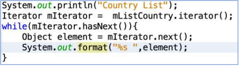
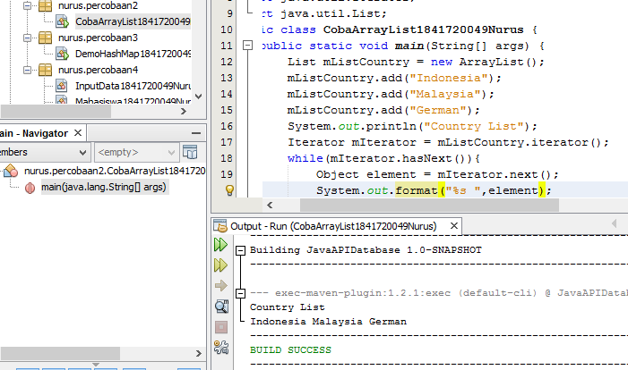
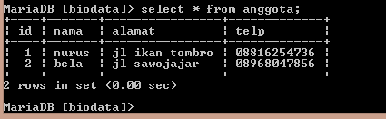

# Laporan Praktikum #12 - Collection (List, Set, Map) dan Database

## Kompetensi

Setelah menyelesaikan lembar kerja ini mahasiswa diharapkan mampu:
1.  Memahami cara penyimpanan objek menggunakan Collection dan Map.
2.  Mengetahui pengelompokan dari Collection.
3.  Mengetahui perbedaan dari interface Set, List dan Map.
4.  Mengetahui penggunaan class-class dari interface Set, List dan Map.
5.  Memahami koneksi database menggunakan JDBC dan JDBC API

## Ringkasan Materi

Collection adalah suatu objek yang bisa digunakan untuk menyimpan sekumpulan objek. Objek yang ada dalam Collection disebut elemen. Collection menyimpan elemen yang bertipe 
Object, sehingga berbagai tipe object  bisa disimpan dalam Collection. Class-class mengenai 
Collection tergabung dalam Java Collection Framework. Class-class Collection diletakkan 
dalam package java.util dan mempunyai dua interface utama yaitu Collection. Collection terbagi menjadi 3 jenis yaitu set, list dan map dan terdapat juga JDBC API.

##  Percobaan 1 - Set

### Langkah Percobaan (HashSet)

1. 

link kode program : 

[ini link ke kode program Hello GUI](../../src/12_Java_API/DemoHashSet1841720049Nurus.java)

### Pertanyaan

1.  Apakah fungsi import java.util.*; pada program diatas!

Jawab : untuk menamplikan semua inputan yang ada dalam satu project

2.  Pada baris program keberapakah yang berfungsi untuk menciptakan object HashSet?

Jawab : pada baris ke-12

3.  Apakah fungsi potongan program dibawah ini pada percobaan 1! 

Jawab : untuk menambahkan isi dari suatu objek tersebut

4.  Tambahkan set.add(“Malang”); kemudian jalankan program! Amati hasilnya dan jelaskan mengapa terjadi error!

Jawab : dikarenakan tidak terdapat objek set.add hanya terdapat mSetCity.add

5.  Jelaskan fungsi potongan program dibawah ini pada percobaan 1!

Jawab : fungsi tersebut digunakan untuk perulangan 

## Percobaan 2 - List

### Langkah Percobaan (ArrayList)

1. 

link kode program : 

[ini link ke kode program](../../src/12_Java_API/CobaArrayList1841720049Nurus.java)

### Pertanyaan 
1.  Apakah fungsi potongan program dibawah ini!

Jawab : digunakan untuk mengurutkan pada index ke 0 dan ke 2

2. Ganti potongan program pada soal no 1 menjadi sebagai berikut

Kemudian jalankan program tersebut!

Jawab : 

3. Jelaskan perbedaan menampilkan data pada ArrayList menggunakan potongan program pada soal no 1 dan no 2!

Jawab : sebelumnya masih berupa data yang menjelaskan bahwa list n merupakan index ke n setelah dirubah hanya berupa isi dari objeknya saja

## Percobaan 3 - Map
### Langkah Percobaan 

1. 

link kode program : 

[ini link ke kode program](../../src/12_Java_API/DemoHashMap1841720049Nurus.java)

### Pertanyaan 

1. Jelaskan fungsi hMapItem.put("1","Biskuit") pada program!

Jawab : menambahkan item pertama pada index pertama

2. Jelaskan fungsi hMapItem.size() pada program!

Jawab : untuk mendeklarasikan ukuran pada objek

3. Jelaskan fungsi hMapItem.remove("1") pada program!

Jawab : untuk menghapus isi dari objek pada index ke 1

4. Jelaskan fungsi hMapItem.clear() pada program!

Jawab : untuk membersihkan isi-isi dari objek

5. Tambahkan kode program yang di blok pada program yang sudah anda buat!
6. Jalankan program dan amati apa yang terjadi! 
Jawab : 
7. Apakah perbedaan program sebelumnya dan setelah ditambahkan kode program pada soal no 5 diatas? Jelaskan!

Jawab : lebih tertata/tersusun pada saat menambahkan isi pada objek

## Percobaan 4 - ImplemeNtasi ArrayList dalam GUI
### Langkah Percobaan 

1. 
2. 
3. 

link kode program : 

[ini link ke kode program input data](../../src/12_Java_API/InputData1841720049Nurus.java)
[ini link ke kode program mahasiswa](../../src/12_Java_API/Mahasiswa1841720049Nurus.java)
[ini link ke kode program tampil gui](../../src/12_Java_API/TampilGui1841720049Nurus.java)
[ini link ke kode program tampil gui(form)](../../src/12_Java_API/TampilGui1841720049Nurus.form)

## Percobaan 5 - Aplikasi Biodata
### Langkah Percobaan 

link kode program : 

[ini link ke kode program form koneksi](../../src/12_Java_API/FormKoneksi1841720049Nurus.java)
[ini link ke kode form form koneksi](../../src/12_Java_API/FormKoneksi1841720049Nurus.form)

- Setelah menambah code pada action button klik, coba jalankan program dan tambahkan data. Apakah program berhasil menambahkan data? Jika tidak apakah penyebabnya.

    Jawab : 
    

- Jelaskan maksud source code untuk melakukan insert data diatas?

    Jawab : untuk mengisi pada tabel anggota dengan menggunakan query insert pada database biodata
- Jelaskan alur dari method ambil_data_tabel?

    Jawab : method ambil data digunakan untuk mengambil data pada database dengan menambahkan id, nama, alamat dan telepon
## Pernyataan Diri

Saya menyatakan isi tugas, kode program, dan laporan praktikum ini dibuat oleh saya sendiri. Saya tidak melakukan plagiasi, kecurangan, menyalin/menggandakan milik orang lain.

Jika saya melakukan plagiasi, kecurangan, atau melanggar hak kekayaan intelektual, saya siap untuk mendapat sanksi atau hukuman sesuai peraturan perundang-undangan yang berlaku.

Ttd,

***Nurus Laily Aprillia***