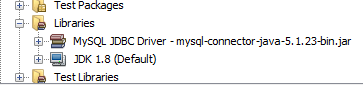
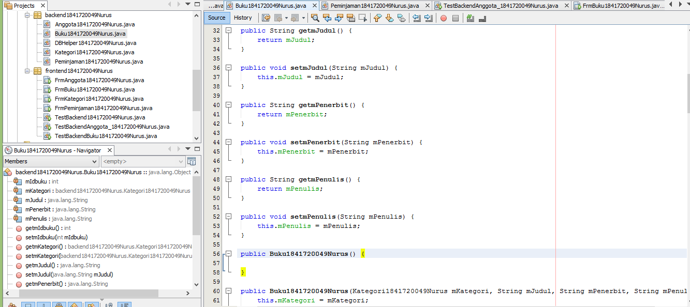

# Laporan Praktikum #14 - GUI dan Database

## Kompetensi
Setelah menempuh materi percobaan ini, mahasiswa mampu mengenal:
1.  Menggunakan paradigma berorientasi objek untuk interaksi dengan database
2.  Membuat backend dan frontend
3.  Membuat form sebagai frontend

## Ringkasan Materi
Secara umum, tahapan yang akan kita lakukan adalah sebagai berikut:
1.  Membuat database dan tabel-tabelnya.
2.  Membuat backend yang berisi class-class yang mewakili data yang ada pada database, dan class helper untuk melakukan eksekusi query database.
3.  Membuat frontend yang merupakan antarmuka kepada pengguna. Frontend ini bisa berbasis teks (console), GUI, web, mobile, dan sebagainya.

Library yang digunakan untuk project ini antara lain:
1.  JDBC, untuk melakukan interaksi ke database.
2.  ArrayList, untuk menampung data hasil query ke database.
3.  Swing, untuk membuat tampilan GUI.

##  Percobaan 

### Percobaan 1

- 
- 
- 
-  

## Percobaan 2

- 

## Percobaan 3 

- 
- 
- 

link kode program : 

- [ini link ke kode program](../../src/14_GUI_dan_Database/DBHelper1841720049Nurus.java)

## Percobaan 4 

- 
- 
- 
- 
- 

link kode program : 

- [ini link ke kode program](../../src/14_GUI_dan_Database/Kategori1841720049Nurus.java)

## Percobaan 5

- 
- 

link kode program : 

- [ini link ke kode program](../../src/14_GUI_dan_Database/TestBackend1841720049Nurus.java)

## Percobaan 6 - Kategori

- 
- 
- 
- 
- 

link kode program : 

- [ini link ke kode program](../../src/14_GUI_dan_Database/FrmKategori1841720049Nurus.form)

## Percobaan 6 - Anggota

- 
- 
- 
- 
- 
- 
- 

link kode program : 

- [ini link ke kode program](../../src/14_GUI_dan_Database/Anggota1841720049Nurus.form)
- [ini link ke kode program](../../src/14_GUI_dan_Database/TestBackendAnggota_1841720049Nurus.java)

## Percobaan 7 - Anggota

- 
- 
- 
- 
- 
- 

link kode program : 

- [ini link ke kode program](../../src/14_GUI_dan_Database/FrmAnggota1841720049Nurus.form)
- [ini link ke kode program](../../src/14_GUI_dan_Database/FrmAnggota1841720049Nurus.java)

## Percobaan 7 - Buku

- 
- 
- 
- 
- 
- 
- 
- 

link kode program : 

- [ini link ke kode program](../../src/14_GUI_dan_Database/Buku1841720049Nurus.java)

## Percobaan 8
- 
- 
- 
- 
- 
- 

link kode program : 
- [ini link ke kode program](../../src/14_GUI_dan_Database/FrmBuku1841720049Nurus.form)
- [ini link ke kode program](../../src/14_GUI_dan_Database/FrmBuku1841720049Nurus.java)

## Tugas
- 
- 
- 
- 
- 
- 
- 
- 
- 
- 
- 

link kode program : 
- [ini link ke kode program](../../src/14_GUI_dan_Database/Peminjaman1841720049Nurus.java)
- [ini link ke kode program](../../src/14_GUI_dan_Database/FrmPeminjaman1841720049Nurus.form)
- [ini link ke kode program](../../src/14_GUI_dan_Database/FrmPeminjaman1841720049Nurus.java)

## Pernyataan Diri

Saya menyatakan isi tugas, kode program, dan laporan praktikum ini dibuat oleh saya sendiri. Saya tidak melakukan plagiasi, kecurangan, menyalin/menggandakan milik orang lain.

Jika saya melakukan plagiasi, kecurangan, atau melanggar hak kekayaan intelektual, saya siap untuk mendapat sanksi atau hukuman sesuai peraturan perundang-undangan yang berlaku.

Ttd,

***Nurus Laily Aprillia***