# Laporan Praktikum #15 - 15_Unit_Testing

## Kompetensi
Setelah menyelesaikan lembar kerja ini mahasiswa diharapkan mampu:
1.  Memahami konsep dan fungsi unit testing
2.  Menerapkan unit testing dengan JUnit pada program sederhana.
3.  Menerapkan unit testing dengan JUnit pada progam yang terkoneksi database

## Ringkasan Materi
Pada percobaan ini kita akan membuat sebuah program sederhana yang mengilustrasikan sebuah aplikasi pengiriman pesan. Pada program tersebut terdapat satu class utama dimana didalamnya terdapat beberapa method sederhana yang nantinya akan dibuatkan unit test-nya.

##  Percobaan 

### Percobaan 1

1. 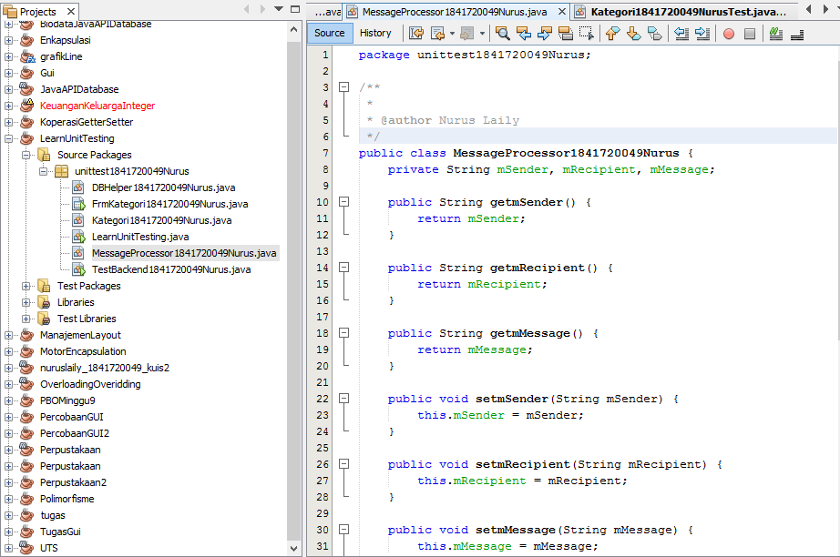
2. 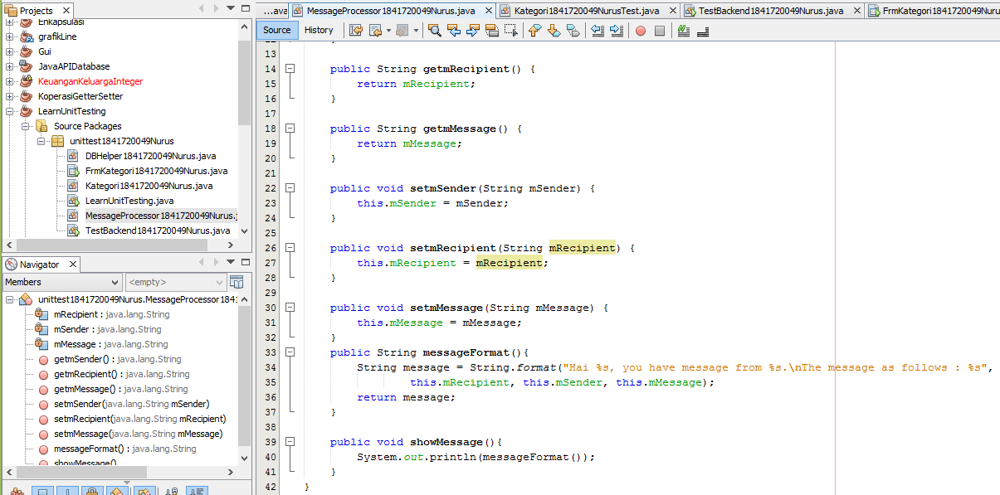
3. 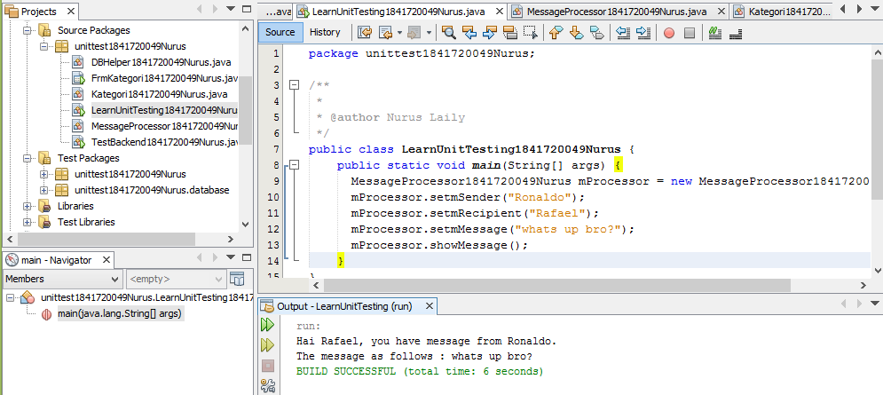
4. 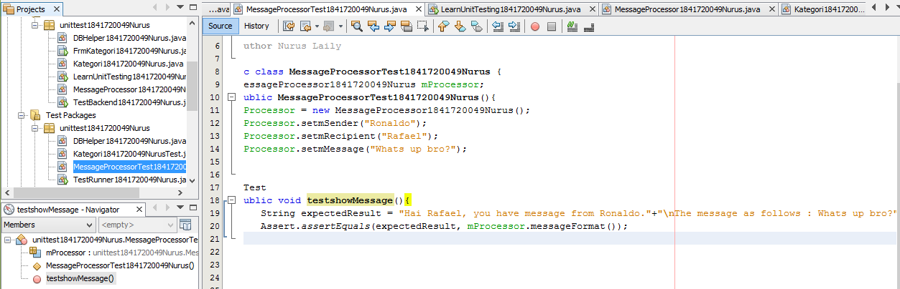 
5. 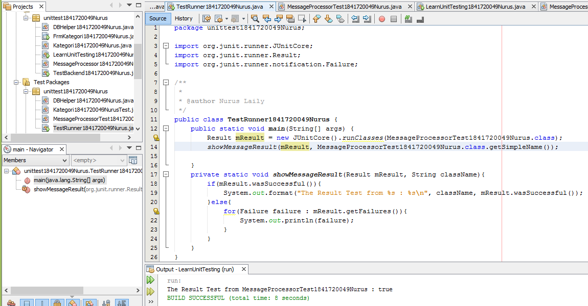
6. 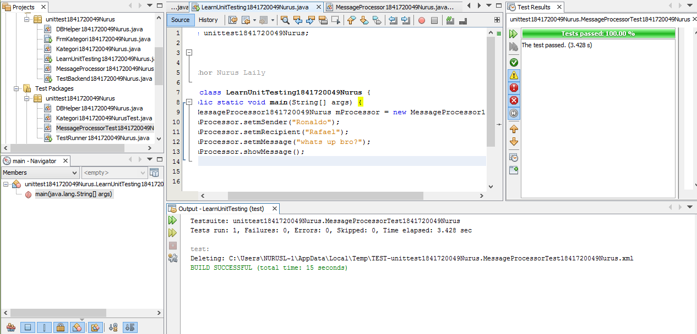

link kode program : 
- [ini link ke kode program](../../src/15_Unit_Testing/src/unittest1841720049Nurus/MessageProcessor1841720049Nurus.java)
- [ini link ke kode program](../../src/15_Unit_Testing/src/unittest1841720049Nurus/LearnUnitTesting1841720049Nurus.java)

## Percobaan 2

1. 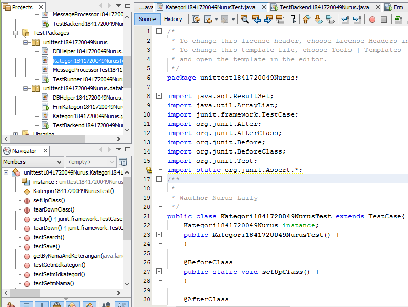
2. 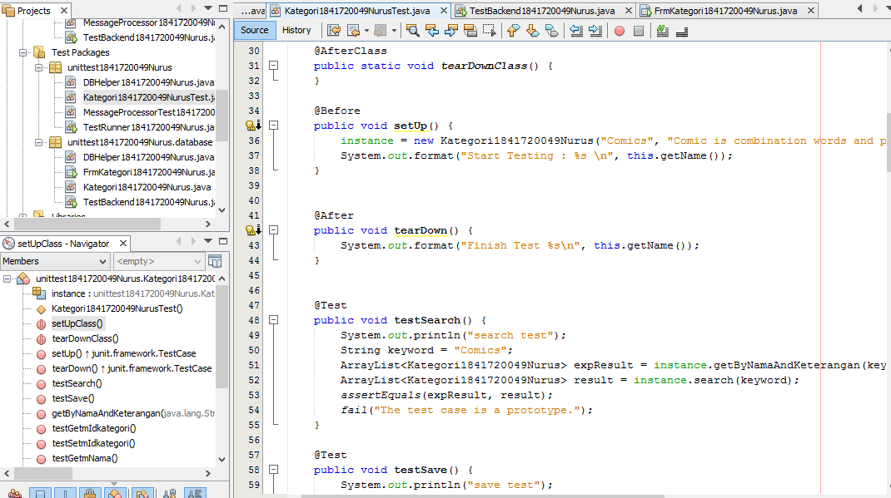
3. 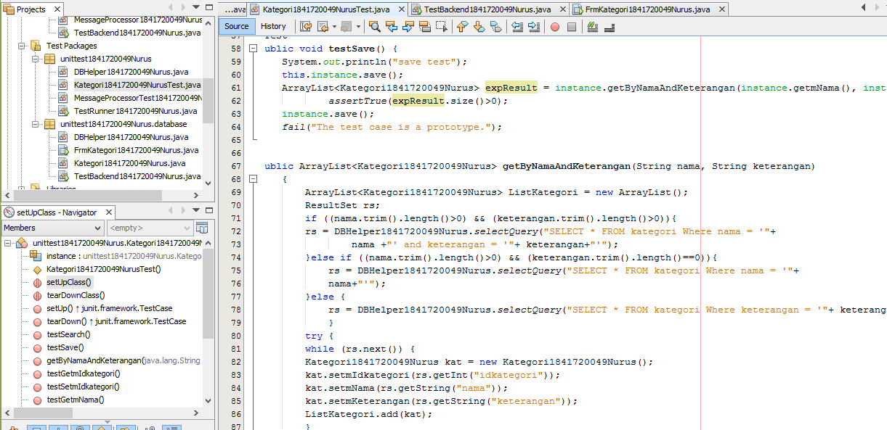
4. 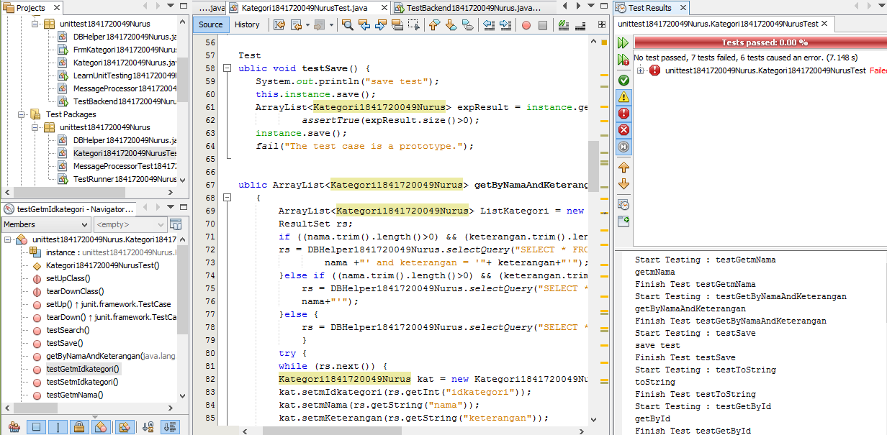
5. 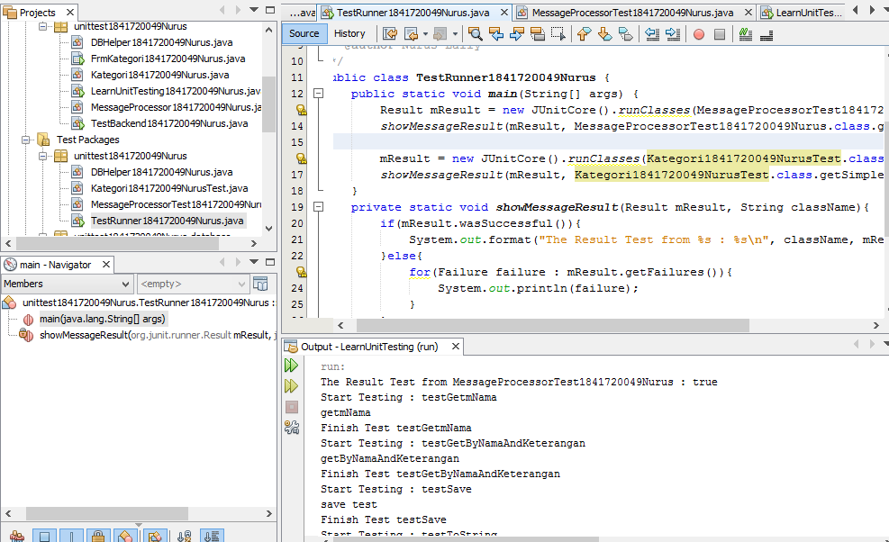

link kode program : 
- [ini link ke kode program](../../src/15_Unit_Testing/test/unittest1841720049Nurus/Kategori1841720049NurusTest.java)
- [ini link ke kode program](../../src/15_Unit_Testing/test/unittest1841720049Nurus/TestRunner1841720049Nurus.java)

## tugas
5. 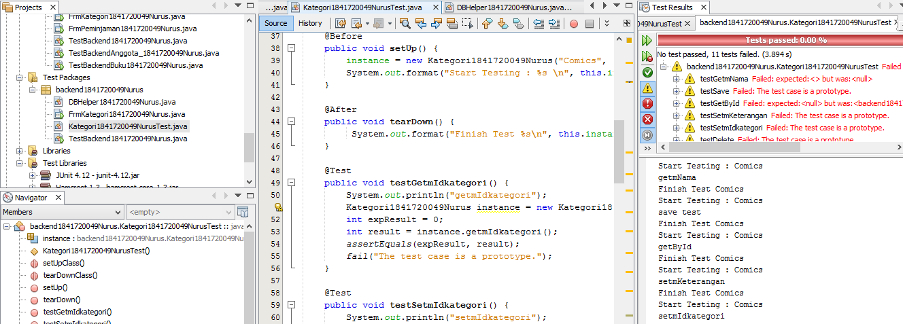

link kode program : 
- [ini link ke kode program](../../src/15_Unit_Testing/tugas/backend1841720049Nurus/Kategori1841720049NurusTest.java)

## Kesimpulan
Dari jobsheet ini untuk mengetest apakah ada yang error atau tidak.
## Pernyataan Diri

Saya menyatakan isi tugas, kode program, dan laporan praktikum ini dibuat oleh saya sendiri. Saya tidak melakukan plagiasi, kecurangan, menyalin/menggandakan milik orang lain.

Jika saya melakukan plagiasi, kecurangan, atau melanggar hak kekayaan intelektual, saya siap untuk mendapat sanksi atau hukuman sesuai peraturan perundang-undangan yang berlaku.

Ttd,

***Nurus Laily Aprillia***