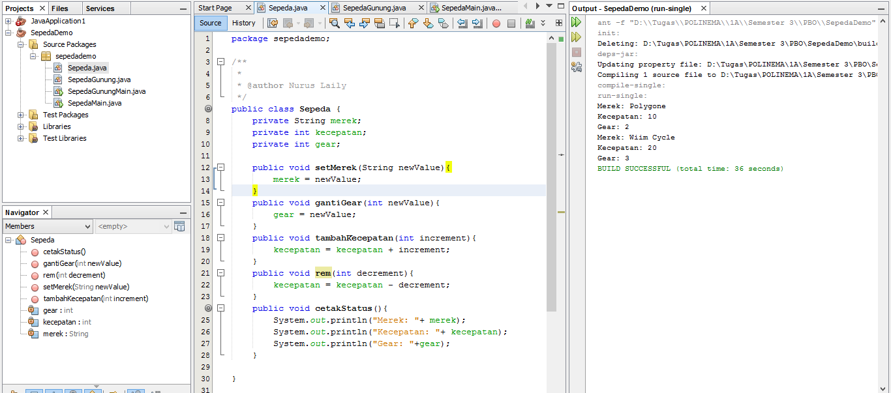
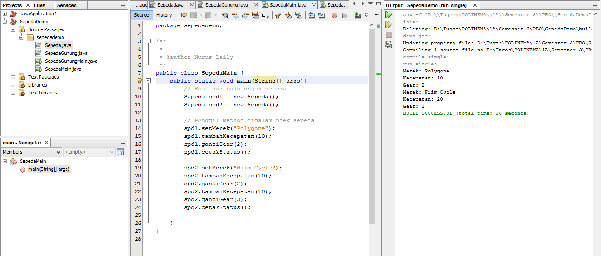
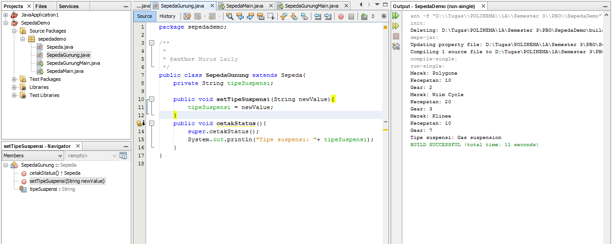
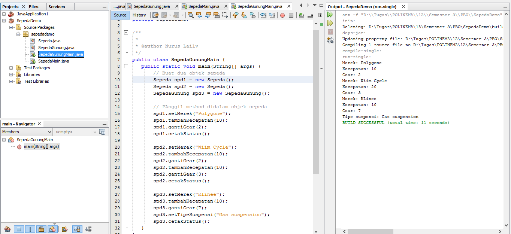
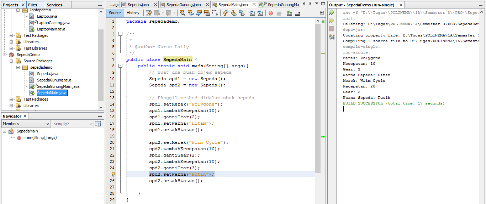
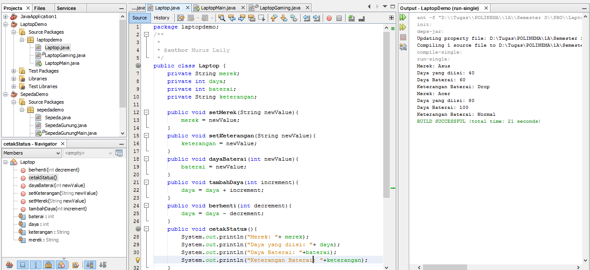
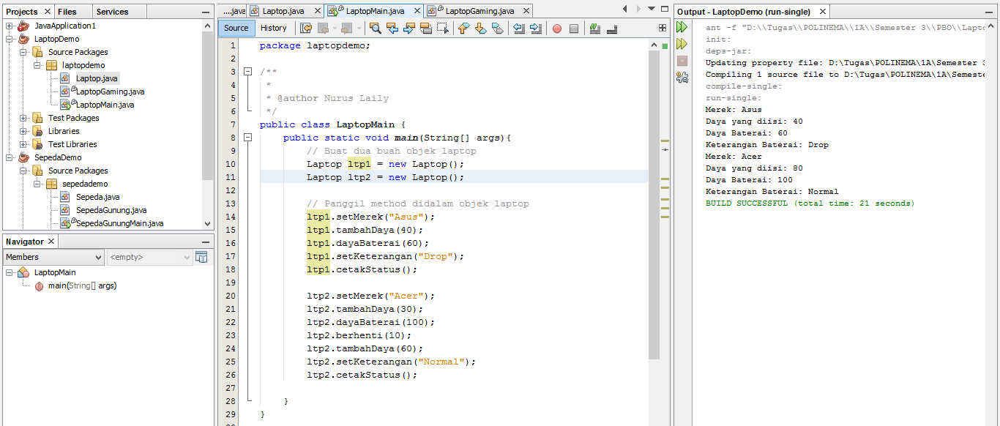
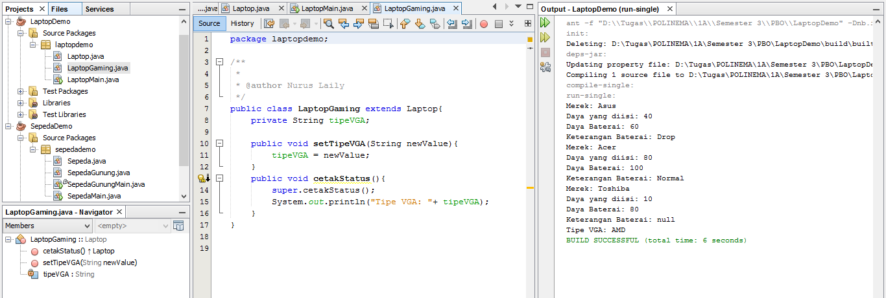
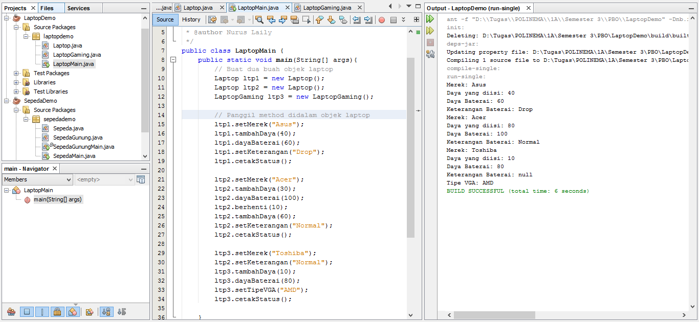

# Laporan Praktikum #1 - Pengantar Konsep PBO

## Kompetensi

(ketiklah kompetensi tiap praktikum di sini)

## Ringkasan Materi

Terdapat 4 pilar dalam PBO yaitu :
1. Enkapsulasi
2. Abstraction
3. Inheritance
4. Polimorfisme

## Percobaan

### Percobaan 1

(berisi penjelasan percobaan 1. Jika ada rujukan ke file program, bisa dibuat linknya di sini.)

link kode program : 
[ini link ke kode program ](../../src/1_Pengantar_Konsep_PBO/Sepeda.java)
[ini link ke kode program main](../../src/1_Pengantar_Konsep_PBO/SepedaMain.java)

### Percobaan 2

(berisi penjelasan percobaan 2. Jika ada rujukan ke file program, bisa dibuat linknya di sini.)

link kode program : 
[ini contoh link ke kode program ](../../src/1_Pengantar_Konsep_PBO/SepedaGunung.java)
[ini contoh link ke kode program main](../../src/1_Pengantar_Konsep_PBO/SepedaGunungMain.java)

## Pertanyaan

1.	Sebutkan dan jelaskan aspek-aspek yang ada pada pemrograman berorientasi objek!
Jawab : Object, Class, Enkapsulasi, Inheritance, Polimorfisme

2.	Apa yang dimaksud dengan object dan apa bedanya dengan class?
Jawab : Object adalah suatu rangkaian dalam program yang terdiri dari state(ciri-ciri/atribut) dan behavior(perilaku). Bedanya dengan class ialah blueprint atau prototype dari object.

3.	Sebutkan salah satu kelebihan utama dari pemrograman berorientasi objek dibandingkan dengan pemrograman struktural!
Jawab : Jika ada perubahan fitur, maka dapat dipastikan keseluruhan program tidak akan terganggu

4.	Pada class Sepeda, terdapat state/atribut apa saja?
Jawab : merek, kecepatan, gear

5.	Tambahkan atribut warna pada class Sepeda.
Jawab : 

6.	Mengapa pada saat kita membuat class SepedaGunung, kita tidak perlu membuat class nya dari nol?
Jawab : dikarenakan pada dasarnya hamper sama dengan class Sepeda yang memiliki kecepatan, memiliki gear, memiliki nama merek, dapat menambah kecepatan, dapat mengerem, pindah gigi, dsb. Namun ada tambahan tipe suspensi, maka dari itu kita extends saja dari class Sepeda lalu kita tambahkan fitur yang belum ada diclass Sepeda.

## Tugas

(silakan kerjakan tugas di sini beserta `screenshot` hasil kompilasi program. Jika ada rujukan ke file program, bisa dibuat linknya di sini.)

link kode program : 
[ini contoh link ke kode program ](../../src/1_Pengantar_Konsep_PBO/Laptop.java)
[ini contoh link ke kode program Main](../../src/1_Pengantar_Konsep_PBO/LaptopMain.java)
[ini contoh link ke kode program extends](../../src/1_Pengantar_Konsep_PBO/LaptopGaming.java)

## Kesimpulan

Kesimpulannya kita bisa menambahkan extends pada class yang lain dalam PBO ini.

## Pernyataan Diri

Saya menyatakan isi tugas, kode program, dan laporan praktikum ini dibuat oleh saya sendiri. Saya tidak melakukan plagiasi, kecurangan, menyalin/menggandakan milik orang lain.

Jika saya melakukan plagiasi, kecurangan, atau melanggar hak kekayaan intelektual, saya siap untuk mendapat sanksi atau hukuman sesuai peraturan perundang-undangan yang berlaku.

Ttd,

Nurus Laily Aprillia