# Laporan Praktikum #2 - Class dan Object

## Kompetensi

  Mahasiswa dapat memahami deskripsi dari class dan object
  Mahasiswa memahami implementasi dari class
  Mahasiswa dapat memahami implementasi dari attribute
  Mahasiswa dapat memahami implementasi dari method
  Mahasiswa dapat memahami implementasi dari proses instansiasi
  Mahasiswa dapat memahami implementasi dari try-catch
  Mahasiswa dapat memahami proses pemodelan class diagram menggunakan UML

## Ringkasan Materi

extends (single-parent)
implements(multiple_class/inface)

## Percobaan

### Percobaan 1

1. 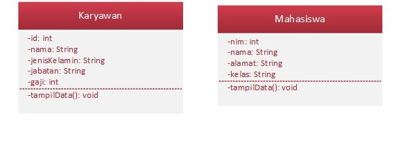
2. Class karyawan dan Class Mahasiswa
3. Karyawan memiliki atribut id, nama, jenis kelamin, jabatan dan gaji. Mahasiswa memiliki atribut nim, nama, alamat dan kelas
4. Karyawan dan mahasiswa memiliki method tampil data bertipe data void

### Percobaan 2

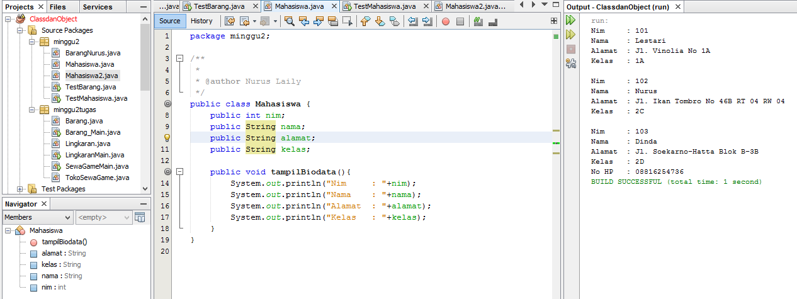
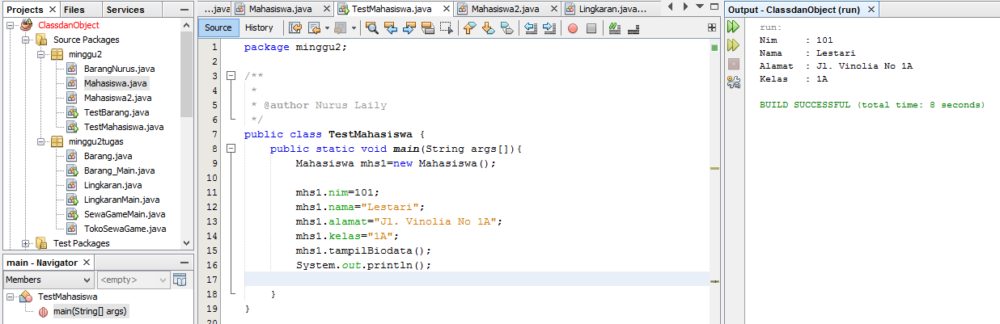

link kode program : 
[ini link ke kode program ](../../src/2_Class_dan_Object/Mahasiswa.java)
[ini link ke kode program main](../../src/2_Class_dan_Object/TestMahasiswa.java)

- Jelaskan pada bagian mana proses pendeklarasian atribut pada program diatas! Pada bagian class  pertama setelah tipedata terdapat variabel, variabel tersebut termasuk ke dalam atribut. (nim, nama, alamat, kelas)
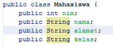
- Jelaskan pada bagian mana proses pendeklarasian method pada program diatas! Pada bagian class pertama yang memiliki tanda kurung (tampilBiodata())
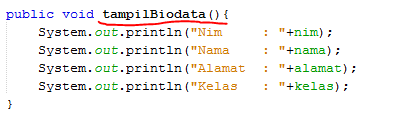
- Berapa banyak objek yang di instansiasi pada program diatas! satu
- Apakah yang sebenarnya dilakukan pada sintaks program “mhs1.nim=101” ? mendeklarasikan bahwa terdapat mahasiswa yang memiliki atribut nim dengan nomor 101
- Apakah yang sebenarnya dilakukan pada sintaks program “mhs1.tampilBiodata()” ? untuk menampilkan atribut-atribut yang akan dideklarasikan
- Instansiasi 2 objek lagi pada program diatas!

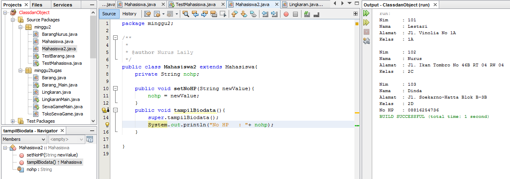
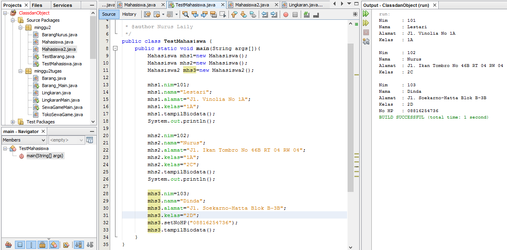
[ini link ke kode program ](../../src/2_Class_dan_Object/Mahasiswa.java)
[ini link ke kode program main](../../src/2_Class_dan_Object/Mahasiswa2.java)
[ini link ke kode program main](../../src/2_Class_dan_Object/TestMahasiswa.java)

### Percobaan 3

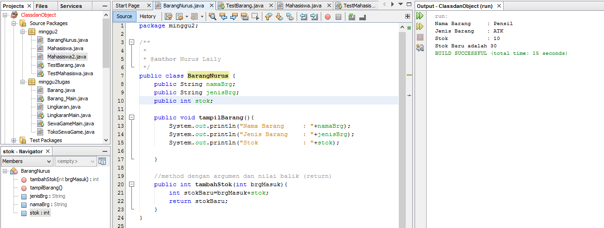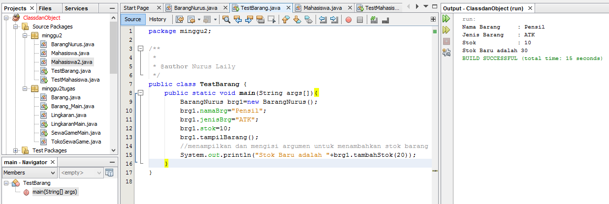

link kode program : 
[ini contoh link ke kode program ](../../src/2_Class_dan_Object/BarangNurus.java)
[ini contoh link ke kode program main](../../src/2_Class_dan_Object/TestBarang.java)

- Apakah fungsi argumen dalam suatu method? argumen tersebut disebut dengan parameter yang berfungsi untuk memanggil parameter dengan suatu atribut yang dibutuhkan 
- Ambil kesimpulan tentang kegunaan dari kata kunci return , dan kapan suatu method harus memiliki return! return digunakan untuk mengembalikan suatu nilai, dan return digunakan pada saat method dengan tipe data yang bukan void

## Tugas
1. Toko Persewaan Video Game
[tugas](img/TokoSewaGame.jpg)

2. Program Toko Persewaan Video Game
[tugas](img/6.PNG)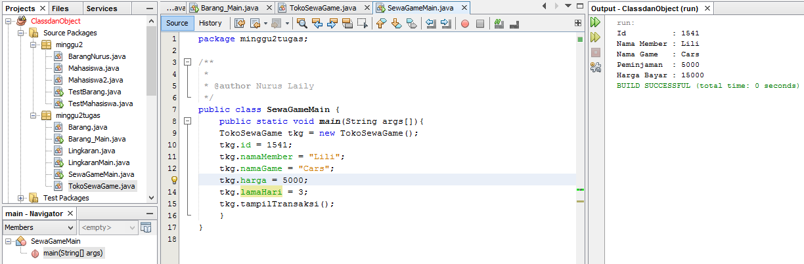

link kode program : 
[ini contoh link ke kode program ](../../src/2_Class_dan_Object/TokoSewaGame.java)
[ini contoh link ke kode program Main](../../src/2_Class_dan_Object/SewaGameMain.java)

3. Lingkaran
Program Lingkaran
[tugas](img/8.1.PNG)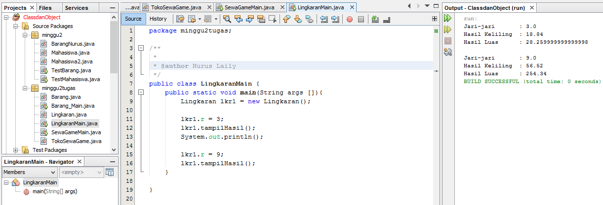

link kode program : 
[ini contoh link ke kode program ](../../src/2_Class_dan_Object/Lingkaran.java)
[ini contoh link ke kode program Main](../../src/2_Class_dan_Object/LingkaranMain.java)

4. Barang
Program Barang
[tugas](img/9.PNG)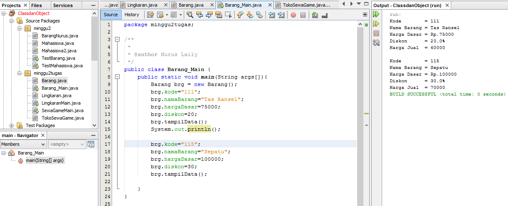

link kode program : 
[ini contoh link ke kode program ](../../src/2_Class_dan_Object/Barang.java)
[ini contoh link ke kode program Main](../../src/2_Class_dan_Object/Barang_Main.java)

## Kesimpulan

Kesimpulannya kita dapat mengetahui tentang atribut dan method pada materi class dan object ini. Dan kita dapat mengetahui secara mendalam apa fungsi pada instansiasi dan parameter.

## Pernyataan Diri

Saya menyatakan isi tugas, kode program, dan laporan praktikum ini dibuat oleh saya sendiri. Saya tidak melakukan plagiasi, kecurangan, menyalin/menggandakan milik orang lain.

Jika saya melakukan plagiasi, kecurangan, atau melanggar hak kekayaan intelektual, saya siap untuk mendapat sanksi atau hukuman sesuai peraturan perundang-undangan yang berlaku.

Ttd,

Nurus Laily Aprillia