# Laporan Praktikum #3 - Enkapsulasi

## Kompetensi

Setelah melakukan percobaan pada modul ini, mahasiswa memahami konsep:
1.  Konstruktor
2.  Akses Modifier
3.  Atribut/method pada class
4.  Intansiasi atribut/method 
5.  Setter dan getter
6.  Memahami notasi pada UML Class Diagram

## Ringkasan Materi

Interface merupakan sekumpulan method tanpa extend, abstrac bisa class aja tanpa method dan dengan extend

## Percobaan

### Percobaan 1 - Enkapsulasi

1. 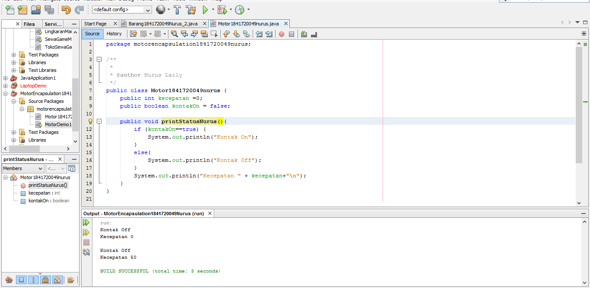
2. 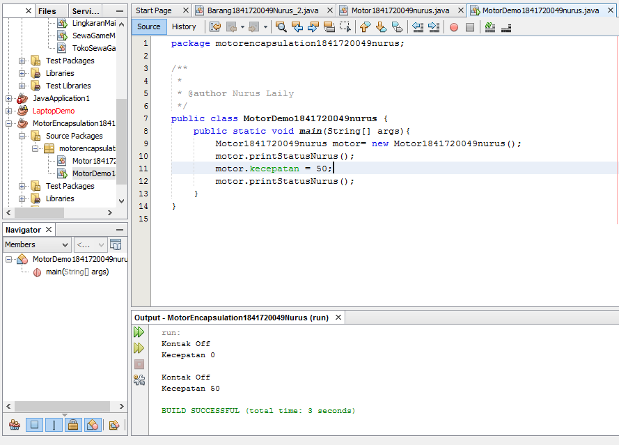
link kode program : 

[ini link ke kode program ](../../src/3_Enkapsulasi/Motor1841720049nurus.java)

[ini link ke kode program main](../../src/3_Enkapsulasi/MotorDemo1841720049nurus.java)

### Percobaan 2 - Access Modifier

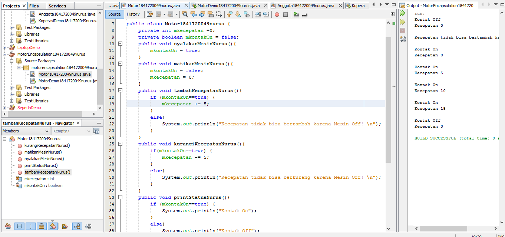
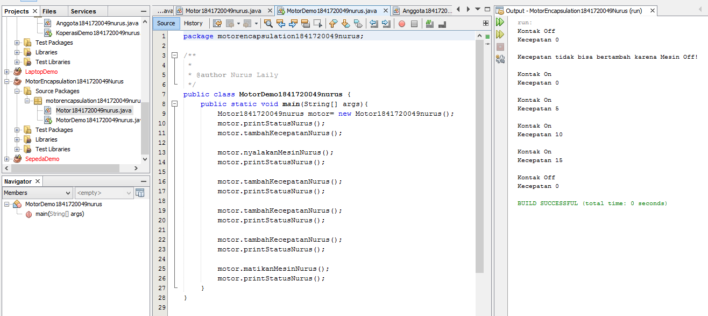

link kode program : 

[ini link ke kode program ](../../src/3_Enkapsulasi/Motor1841720049nurus.java)

[ini link ke kode program main](../../src/3_Enkapsulasi/MotorDemo1841720049nurus.java)

## Pertanyaan – Percobaan 3 dan 4
1.  Pada class TestMobil, saat kita menambah kecepatan untuk pertama kalinya, mengapa 
muncul peringatan “Kecepatan tidak bisa bertambah karena Mesin Off!”? 

Jawab : Dikarenakan pernyataan yang kita dapatkan masih false, lalu kita menambahkan lagi maka pernyataan menjadi true

2.  Mengapa atribut kecepatan dan kontakOn diset private? 

Jawab : Dikarenakan kita sedang menyembunyikan atribut internal dari class lain

3.  Ubah class Motor sehingga kecepatan maksimalnya adalah 100!

Jawab : 

### Percobaan 3 - Getter dan Setter

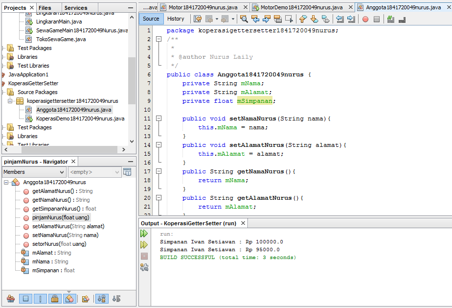
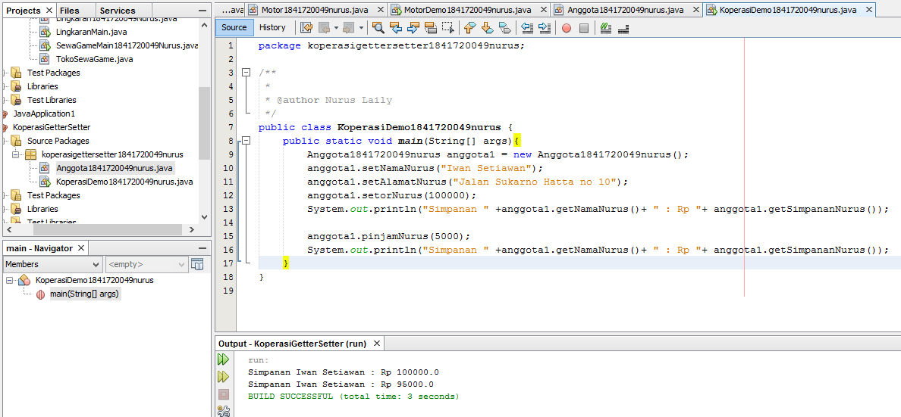

link kode program : 

[ini contoh link ke kode program ](../../src/3_Enkapsulasi/Anggota1841720049nurus.java)

[ini contoh link ke kode program main](../../src/3_Enkapsulasi/KoperasiDemo1841720049nurus.java)

### Percobaan 4 - Konstruktor dan Instansiasi

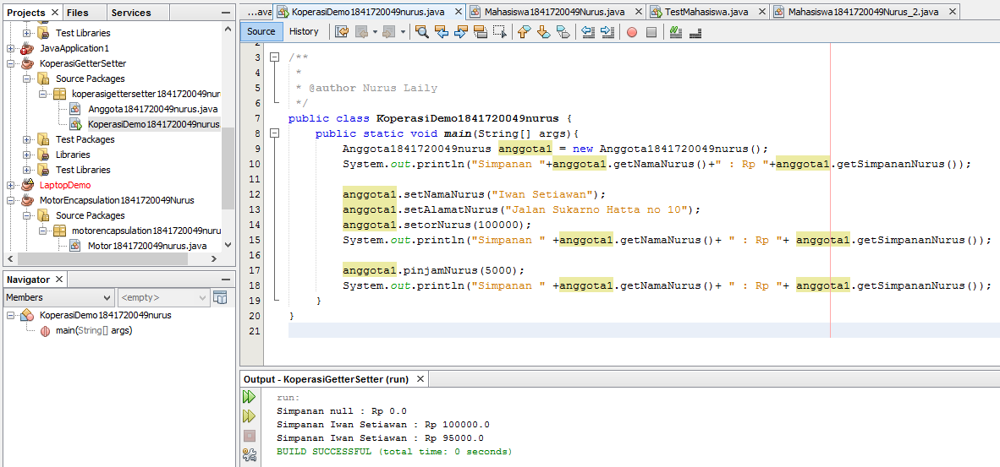
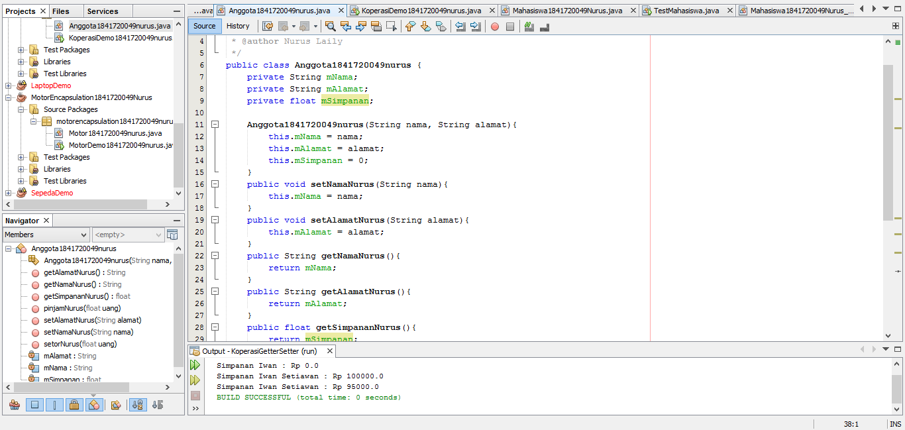
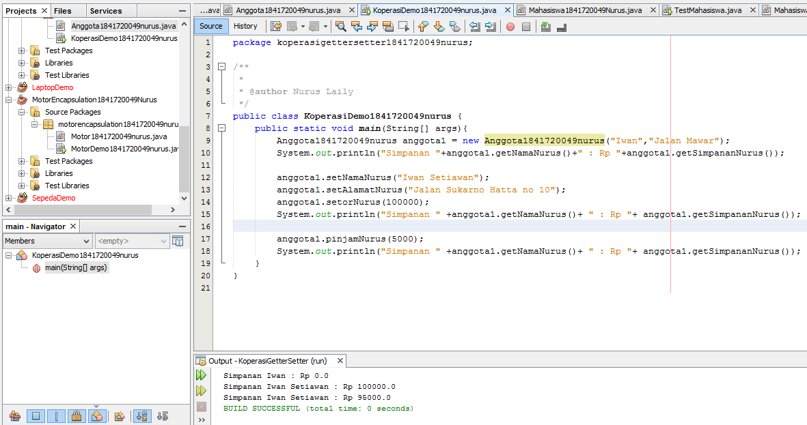

link kode program : 

[ini contoh link ke kode program ](../../src/3_Enkapsulasi/Anggota1841720049nurus.java)

[ini contoh link ke kode program main](../../src/3_Enkapsulasi/KoperasiDemo1841720049nurus.java)

## Pertanyaan – Percobaan 3 dan 4

1.  Apa yang dimaksud getter dan setter?

    Jawab : Getter adalah public method yang digunakan untuk mengambil data dan ditampilkan ke dalam objek dan memiliki tipe data return, yang berfungsi untuk mendapatkan nilai 
dari atribut private. Sedangkan setter adalah public method yang digunakan untuk mengisi dan mengatur data dan tidak memliki tipe data return, 
yang berfungsi untuk memanipulasi nilai dari atribut private.

2.  Apa kegunaan dari method getSimpanan()?

    Jawab : mengambil data simpanan untuk ditampilkan kedalam objek

3.  Method apa yang digunakan untuk menambah saldo?

    Jawab : public void setorNurus(float uang)/void setorNurus()

4.  Apa yand dimaksud konstruktor?

    Jawab : method khusus untuk menampilkan atribut dalam objek

5.  Sebutkan aturan dalam membuat konstruktor?

    Jawab :
-  Nama konstruktor harus sama dengan nama class
-  Konstruktor tidak memiliki tipe data return
-  Konstruktor tidak boleh menggunakan modifier abstract, static, final, dan syncronized 

6.  Apakah boleh konstruktor bertipe private?

    Jawab : Boleh, di java kita dapat memiliki konstruktor dengan modifier private, protected, public or default

7.  Kapan menggunakan parameter dengan passsing parameter?

    Jawab : pada saat terdapat method yang membutuhkan input dari  class main terutama pada konstruktor.

8.  Apa perbedaan atribut class dan instansiasi atribut?

    Jawab : Atribut class  merupakan nilai data yang terdapat pada suatu object yang berasal dari _class_, Sedangkan instansiasi atribut adalah pembuatan dari atribut itu sendiri, meliputi tipe data, nama, serta isi dari atribut.

9.  Apa perbedaan class method dan instansiasi method?

    Jawab : Pada class method kita langsung memanggil dengan mengisikan parameter, sedangkan instansiasi method kita perlu membuat objek baru untuk pemanggilan method.

## Tugas
1. EncapDemo
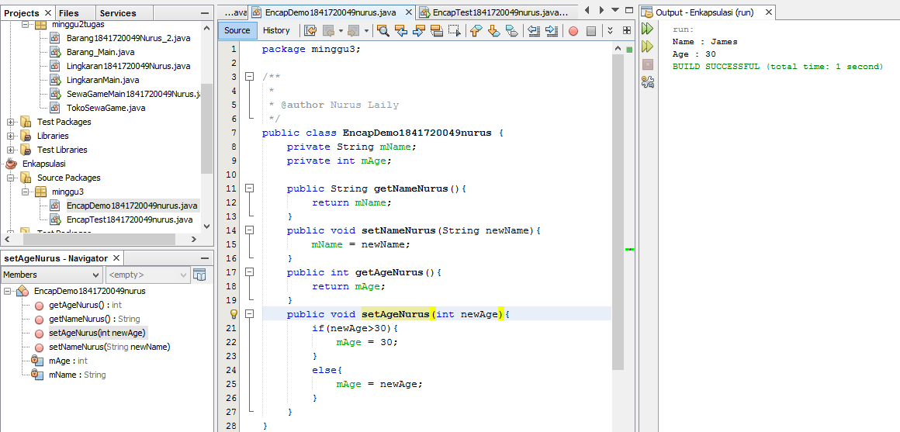
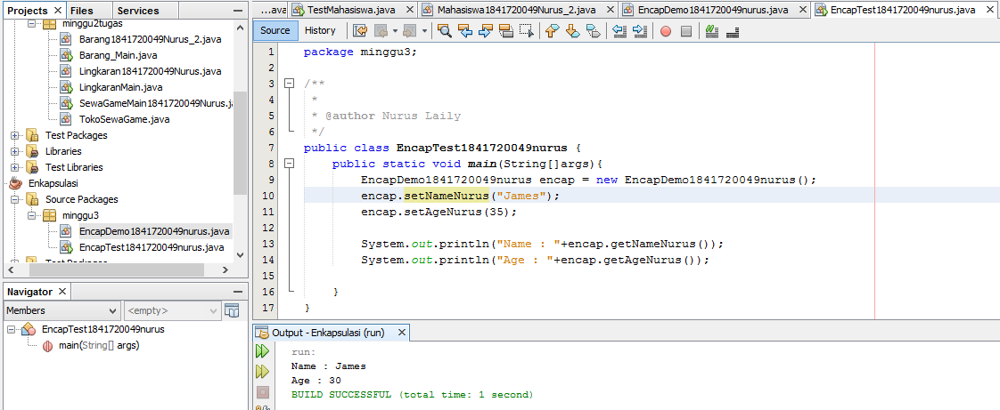

link kode program : 

[ini contoh link ke kode program ](../../src/3_Enkapsulasi/EncapDemo1841720049nurus.java)

[ini contoh link ke kode program ](../../src/3_Enkapsulasi/EncapTest1841720049nurus.java)

2. Dikarenakan didalam method setAge kita mengatur jika/if umur kita lebih dari 30 maka kita output yang akan dikeluarkan adalah output 30

3. Merubah atribut age sehingga bisa diberi nilai maksimal 30 dan minimal 18
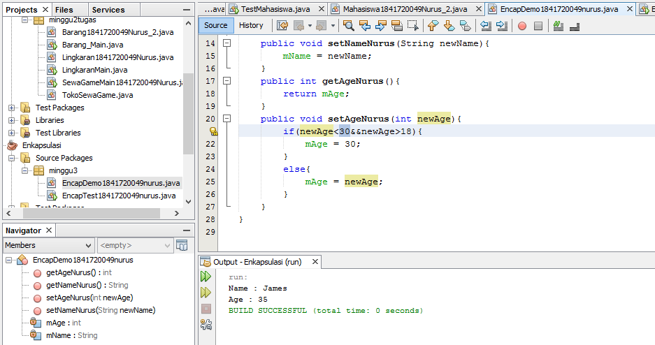 
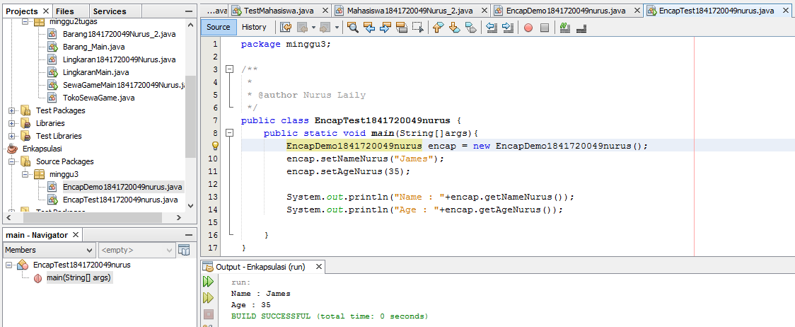

[ini contoh link ke kode program ](../../src/3_Enkapsulasi/EncapDemo1841720049nurus.java)

[ini contoh link ke kode program Main](../../src/3_Enkapsulasi/EncapTest1841720049nurus.java)

4. Koperasi Simpan Pinjam
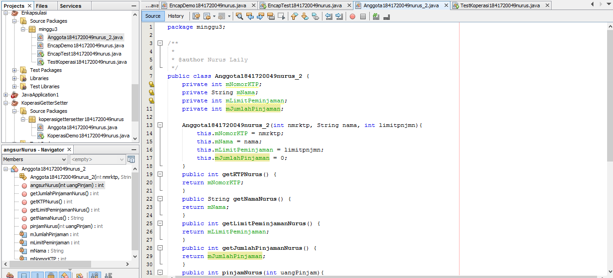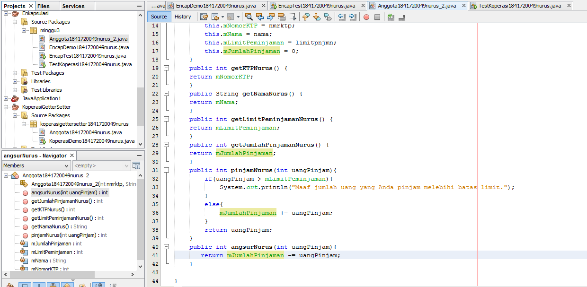
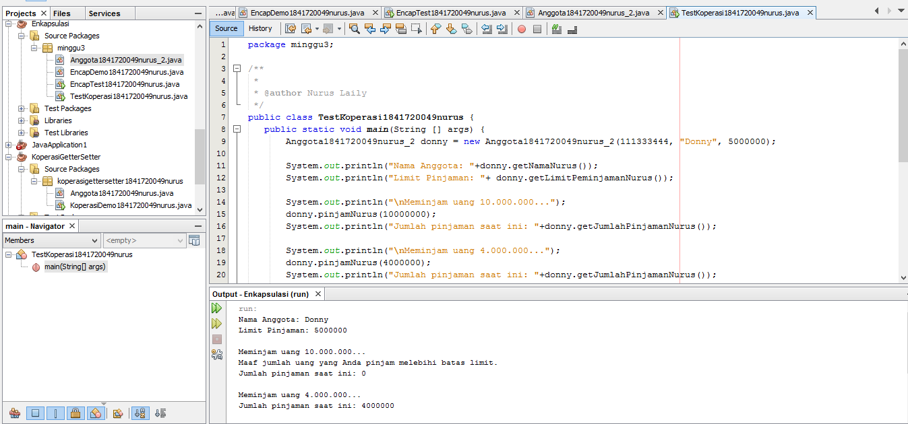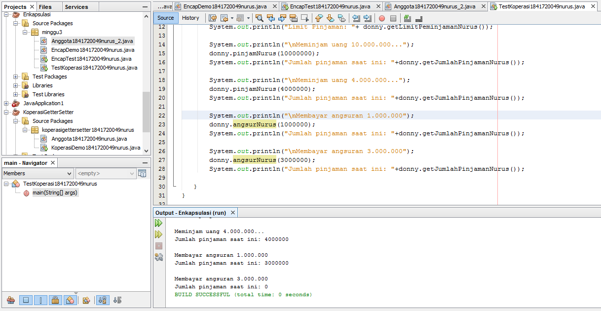

link kode program : 

[ini contoh link ke kode program ](../../src/3_Enkapsulasi/Anggota1841720049nurus_2.java)

[ini contoh link ke kode program Main](../../src/3_Enkapsulasi/TestKoperasi1841720049nurus.java)

5. 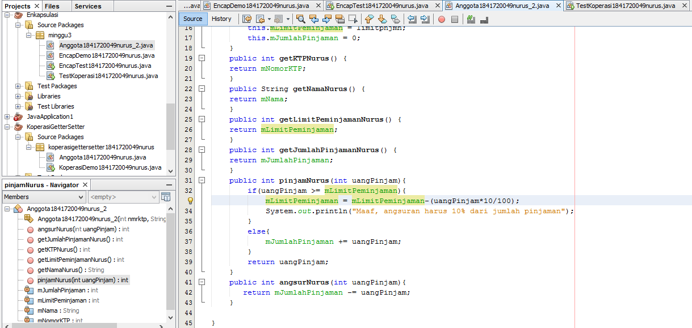
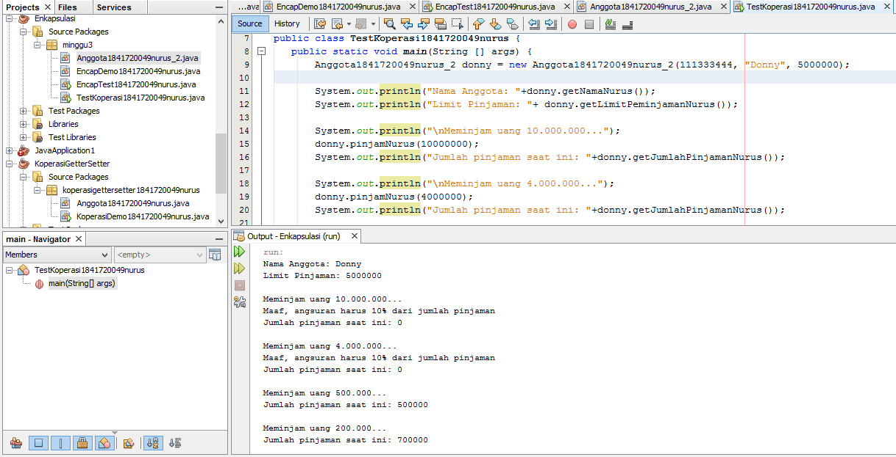
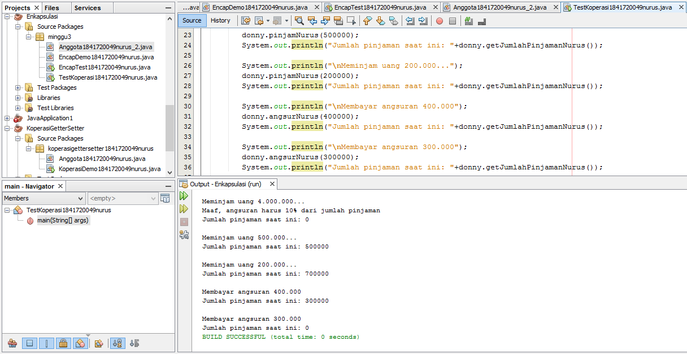

6. 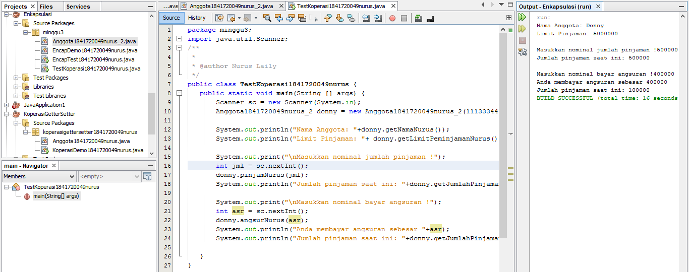

## Kesimpulan

Kesimpulannya kita bisa mengetahui fungsi dari konstruktor, method class, instansiasi objek, getter dan setter, access modifier, enkapsulasi serta menyesuaikan class diagram dengan notasi programnya.

## Pernyataan Diri

Saya menyatakan isi tugas, kode program, dan laporan praktikum ini dibuat oleh saya sendiri. Saya tidak melakukan plagiasi, kecurangan, menyalin/menggandakan milik orang lain.

Jika saya melakukan plagiasi, kecurangan, atau melanggar hak kekayaan intelektual, saya siap untuk mendapat sanksi atau hukuman sesuai peraturan perundang-undangan yang berlaku.

Ttd,

Nurus Laily Aprillia