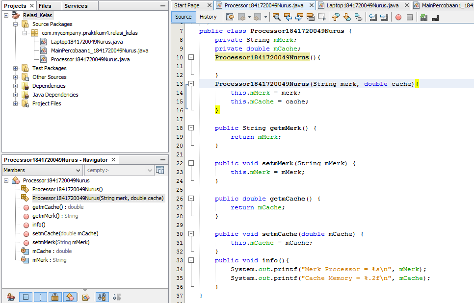
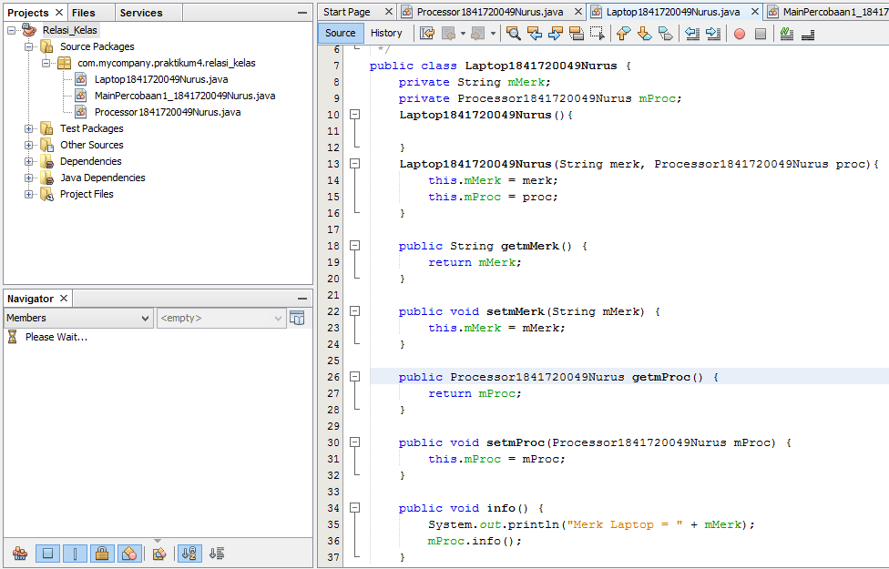
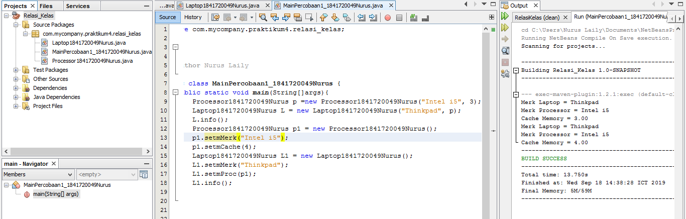
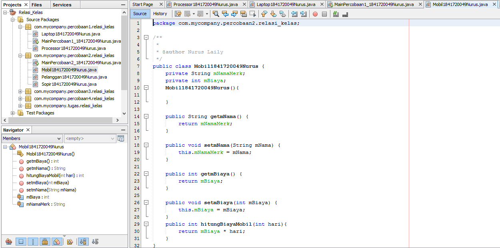
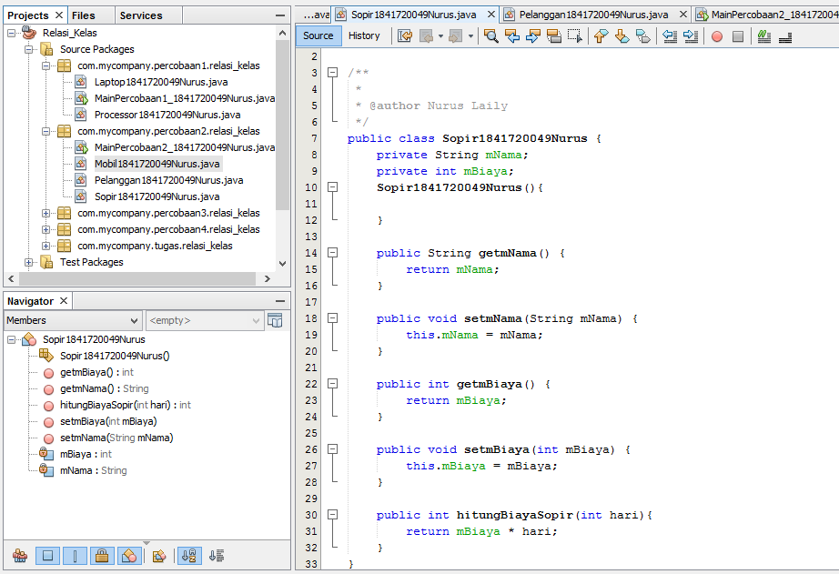
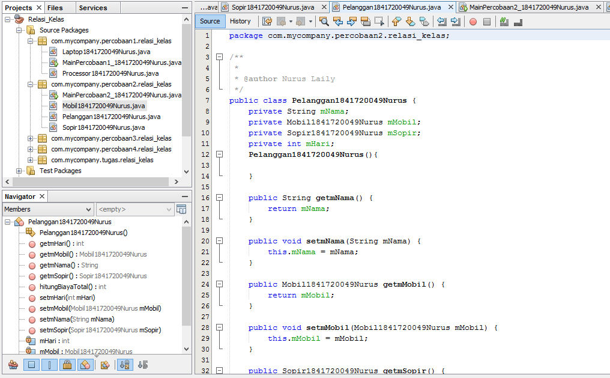
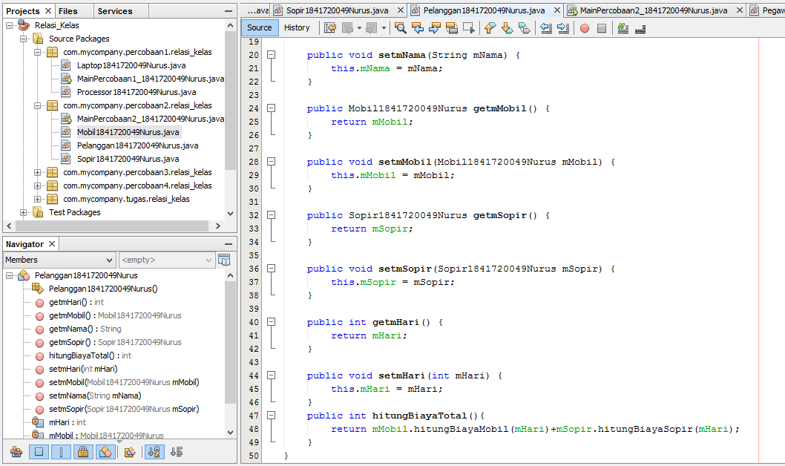
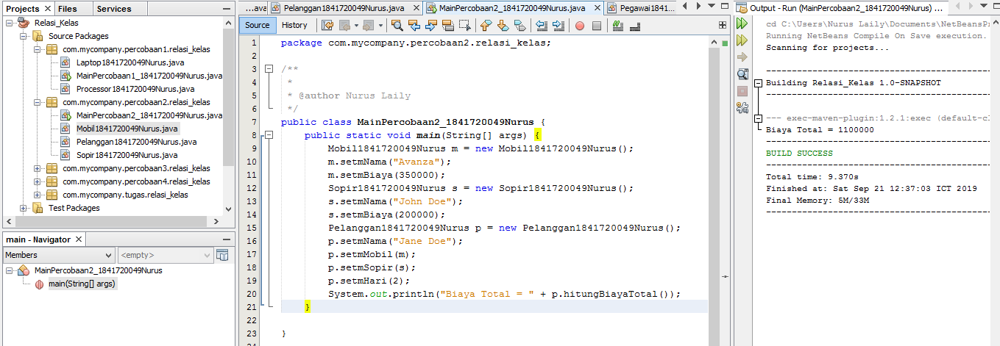
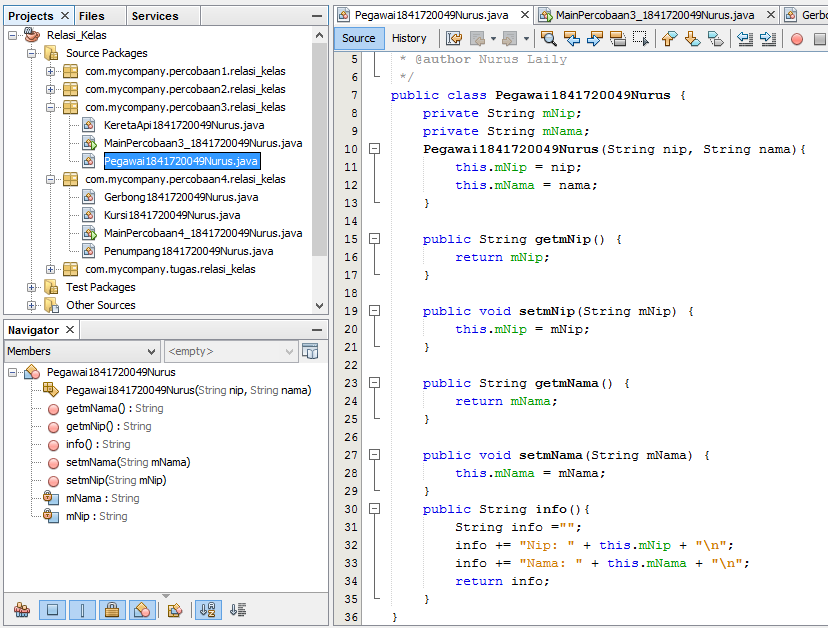

# Laporan Praktikum #4 - Relasi Kelas

## Kompetensi

Setelah menempuh pokok bahasan ini, mahasiswa mampu:
1.  Memahami konsep relasi kelas;
2.  Mengimplementasikan relasi has‑a dalam program.

## Ringkasan Materi

Interface merupakan sekumpulan method tanpa extend, abstrac bisa class aja tanpa method dan dengan extend

## Praktikum

### Percobaan 1

1. 
2. 
3. 
link kode program : 

[ini link ke kode program ](../../src/4_Relasi_Class/Processor1841720049Nurus.java)

[ini link ke kode program ](../../src/4_Relasi_Class/Laptop1841720049Nurus.java)

[ini link ke kode program ](../../src/4_Relasi_Class/MainPercobaan1_1841720049Nurus.java)

## Pertanyaan

Berdasarkan percobaan 1, jawablah pertanyaan‑pertanyaan yang terkait:
1.  Di dalam  class  Processor  dan  class  Laptop  , terdapat method  setter  dan  getter  untuk masing‑masing atributnya. Apakah gunanya method setter dan getter tersebut ?

Jawab :  method setter digunakan untuk mengatur nilai awal. Method getter digunakan untuk menampilkan hasil dari hasil perhitungan

2.  Di dalam  class  Processor  dan  class  Laptop, masing‑masing terdapat konstruktor default dan konstruktor berparameter. Bagaimanakah  beda penggunaan dari kedua jenis 
konstruktor tersebut ? 

Jawab : konstruktor default adalah jenis konstruktor yang disebut secara otomatis. Konstruktor berparameter adalah jenis konstruktor yang telah ditentukan oleh programmer dan parameter itu disi pada main.

3.  Perhatikan  class  Laptop, di  antara 2 atribut yang dimiliki (merk  dan  proc), atribut manakah yang bertipe object ?

Jawab : atribut proc/processor

4.  Perhatikan  class  Laptop, pada baris manakah yang menunjukan bahwa  class  Laptop memiliki relasi dengan class Processor ?

Jawab : pada kalimat private Processor proc

5.  Perhatikan pada class Laptop , Apakah guna dari sintaks proc.info() ?

Jawab : untuk menampilkan info/output yang terdapat di class processor

6.  Pada class MainPercobaan1, terdapat baris kode:
Laptop l = new Laptop("Thinkpad", p);.Apakah p tersebut ?
Dan apakah yang terjadi jika baris kode tersebut diubah menjadi:
Laptop l = new Laptop("Thinkpad",  new Processor("Intel i5", 
3));
Bagaimanakah hasil program saat dijalankan, apakah ada perubahan ?

Jawab : p digunakan untuk memanggil objek processor. Jika diubah hasilnya akan sama saja.

### Percobaan 2 

link kode program : 

[ini link ke kode program ](../../src/4_Relasi_Class/Mobil1841720049nurus.java)

[ini link ke kode program ](../../src/4_Relasi_Class/Sopir1841720049nurus.java)

[ini link ke kode program ](../../src/4_Relasi_Class/Pelanggan1841720049nurus.java)

[ini link ke kode program ](../../src/4_Relasi_Class/MainPercobaan2_1841720049nurus.java)

## Pertanyaan 

1.  Perhatikan class  Pelanggan. Pada baris program manakah  yang menunjukan bahwa class Pelanggan memiliki relasi dengan class Mobil dan class Sopir ?

Jawab : private Mobil mobil;
private Sopir sopir;

2.  Perhatikan  method  hitungBiayaSopir  pada class Sopir, serta method hitungBiayaMobil  pada class  Mobil. Mengapa menurut Anda  method  tersebut harus memiliki argument hari ?

Jawab : karena diperlukan untuk menghitung jumlah biaya yang biayanya dihitung perharinya.

3.  Perhatikan kode dari class Pelanggan. Untuk apakah perintah mobil.hitungBiayaMobil(hari) dan sopir.hitungBiayaSopir(hari) ?

Jawab : 
-	Mobil.hitungbiayamobil(hari) digunakan untuk mendapatkan nilai biaya sewa mobil. 
-	sopir.hitungbiayasopir(hari) digunakan untuk mendapatkan nilai biaya sewa sopir

4.  Perhatikan  class  MainPercobaan2. Untuk apakah sintaks  p.setMobil(m) dan p.setSopir(s) ?

Jawab : untuk memanggil dan mengisi atribut mobil dan sopir pada objek pelanggan.

5.  Perhatikan class  MainPercobaan2. Untuk apakah proses  p.hitungBiayaTotal() tersebut ?

Jawab : untuk menghitung biaya total dari perhitungan biaya sewa mobil dan biaya sewa sopir. 

6.  Perhatikan class  MainPercobaan2, coba tambahkan pada baris terakhir dari  method main dan amati perubahan saat di‑run!
System.out.println(p.getMobil().getMerk());
Jadi untuk apakah sintaks p.getMobil().getMerk() yang ada di dalam method main tersebut?

Jawab : 

### Percobaan 3 

link kode program : 

[ini contoh link ke kode program ](../../src/4_Relasi_Class/)

[ini contoh link ke kode program main](../../src/4_Relasi_Class/)

## Pertanyaan 

1.  Di dalam  method  info()  pada  class  KeretaApi, baris this.masinis.info()  dan this.asisten.info() digunakan untuk apa ?

Jawab : method info() pada class keretaApi digunakan untuk memanggil method info yang berada dalam objek masinis. This.masinis.info() dan This.asisten.info() digunakan untuk menampilkan output dari objek tersebut. 

2.  Buatlah  main  program baru dengan nama  class  MainPertanyaan  pada  package  yang sama. Tambahkan kode berikut pada method main() !
Pegawai masinis = new Pegawai("1234", "Spongebob Squarepants");
KeretaApi keretaApi = new KeretaApi("Gaya Baru", "Bisnis" masinis);
System.out.println(keretaApi.info());

Jawab : 

3.  Apa hasil output dari main program tersebut ? Mengapa hal tersebut dapat terjadi ?

Jawab :

4.  Perbaiki class KeretaApi sehingga program dapat berjalan !

Jawab :

### Percobaan 4

link kode program : 

[ini contoh link ke kode program ](../../src/4_Relasi_Class/)

[ini contoh link ke kode program main](../../src/4_Relasi_Class/)

## Pertanyaan 
1.  Pada  main  program dalam  class  MainPercobaan4, berapakah jumlah kursi dalam Gerbong A ?

Jawab : 10 kursi

2.  Perhatikan potongan kode pada  method  info()  dalam class Kursi. Apa maksud kode tersebut ?
...
if (this.penumpang != null) {
info += "Penumpang: " + penumpang.info() + "\n";
}
...

Jawab : Jika penumpang “null” maka informasi penumpang tidak ditampilkan

3.  Mengapa pada  method  setPenumpang()  dalam  class  Gerbong, nilai nomor dikurangi dengan angka 1 ?

Jawab : Karena menggunakan array, maka menghitung indeksnya otomatis dari 0.

4.  Instansiasi objek baru budi dengan tipe  Penumpang, kemudian masukkan objek baru tersebut pada gerbong dengan  gerbong.setPenumpang(budi, 1). Apakah yang terjadi ?

Jawab : penumpang Budi akan menduduki kursi 1

5.  Modifikasi program sehingga  tidak diperkenankan untuk menduduki kursi yang sudah ada penumpang lain !

Jawab : 

## Tugas

1. Bioskop

## Kesimpulan

## Pernyataan Diri

Saya menyatakan isi tugas, kode program, dan laporan praktikum ini dibuat oleh saya sendiri. Saya tidak melakukan plagiasi, kecurangan, menyalin/menggandakan milik orang lain.

Jika saya melakukan plagiasi, kecurangan, atau melanggar hak kekayaan intelektual, saya siap untuk mendapat sanksi atau hukuman sesuai peraturan perundang-undangan yang berlaku.

Ttd,

Nurus Laily Aprillia