# Laporan Praktikum #4 - Inheritance (Pewarisan)

## Kompetensi

1.  Memahami konsep	dasar inheritance atau pewarisan.
2.  Mampu membuat suatu	subclass dari suatu superclass tertentu.
3.  Mampu mengimplementasikan konsep single dan multilevel inheritance.
4.  Mampu membuat objek	dari suatu subclass dan melakukan pengaksesan terhadap atribut dan method	baik yang dimiliki sendiri atau turunan dari superclass nya.

## Ringkasan Materi

Inheritance	atau pewarisan sifat merupakan suatu cara untuk menurunkan suatu class yang lebih umum menjadi suatu class yang lebih spesifik. Terdapat parent class dan subclass. Cirinya adalah dengan menggunakan extends.

##  Percobaan 1 (Extends)

### TAHAPAN	PERCOBAAN

1. 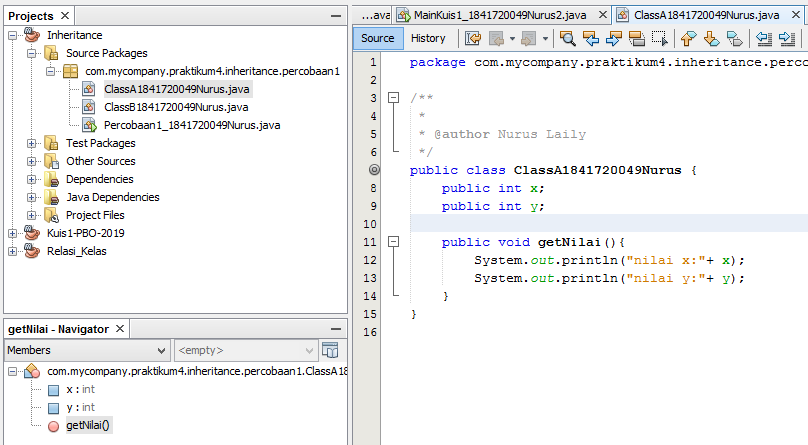
2. 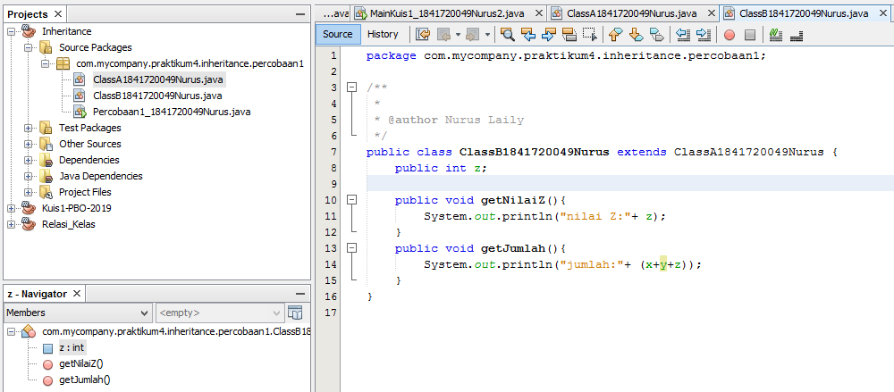
3. 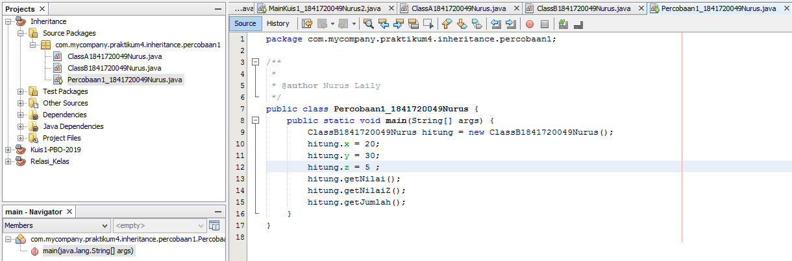

link kode program : 

[ini link ke kode program class A pertama](../../src/6_Inheritance/ClassA1841720049Nurus.java)

[ini link ke kode program class B pertama](../../src/6_Inheritance/ClassB1841720049Nurus.java)

[ini link ke kode program main](../../src/6_Inheritance/Percobaan1_1841720049Nurus.java)

### Pertanyaan

1. Pada percobaan 1 diatas program yang dijalankan terjadi error, kemudian perbaiki sehingga program tersebut bisa dijalankan dan tidak error!

    Jawab : menambahkan extends ClassA1841720049Nurus kedalam ClassB1841720049Nurus

2. Jelaskan	apa	penyebab program pada percobaan 1	ketika dijalankan terdapat error!

    Jawab : dikarenakan untuk menghubungkan antara  ClassB1841720049Nurus dengan ClassA1841720049Nurus, kita harus menghubungkannya dengan extends yang merupakan ClassB1841720049Nurus pewarisan dari ClassA1841720049Nurus.

## Percobaan 2 (Hak Akses)

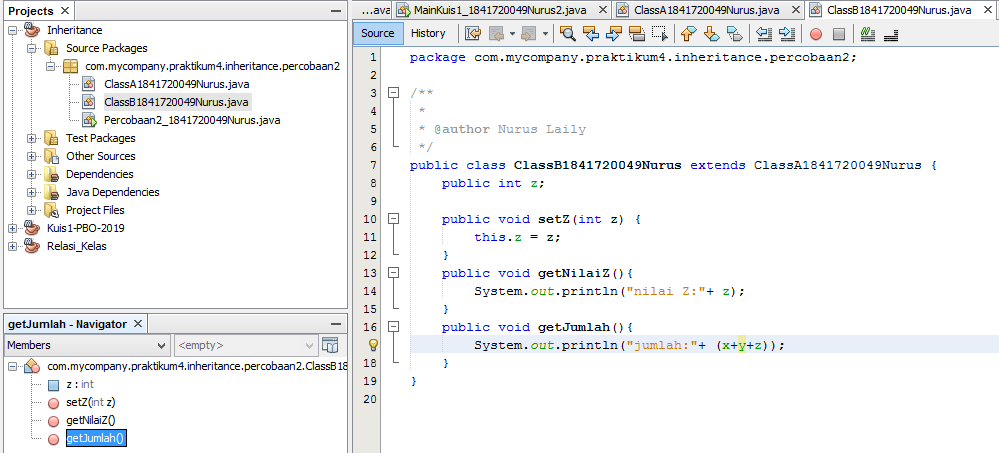
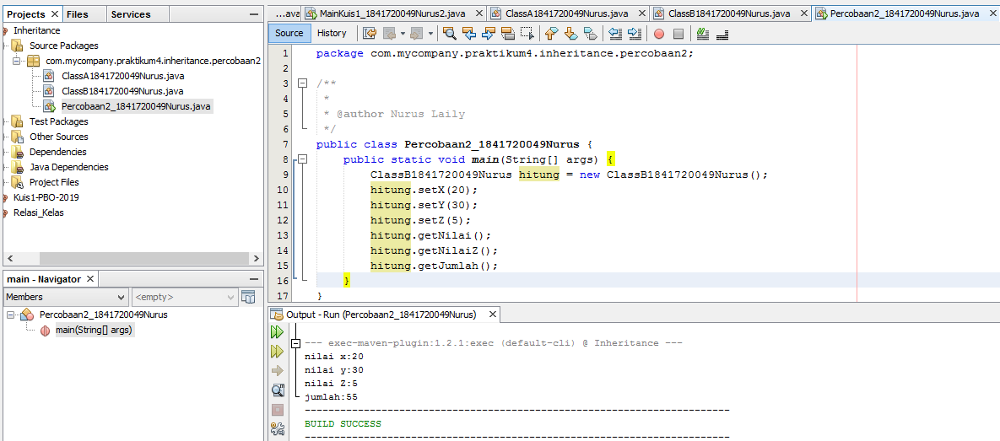

link kode program : 

[ini link ke kode program class A kedua](../../src/6_Inheritance/Percobaan2/ClassA1841720049Nurus.java)

[ini link ke kode program class B kedua](../../src/6_Inheritance/Percobaan2/ClassB1841720049Nurus.java)

[ini link ke kode program main](../../src/6_Inheritance/Percobaan2/Percobaan2_1841720049nurus.java)

### Pertanyaan 

1. Pada	percobaan 2	diatas program yang dijalankan terjadi error, kemudian perbaiki sehingga program tersebut bisa dijalankan dan tidak error!

    Jawab : menambahkan extends ClassA1841720049Nurus kedalam ClassB1841720049Nurus

2. Jelaskan	apa	penyebab program pada percobaan 2	ketika dijalankan terdapat error!

    Jawab: dikarenakan untuk menghubungkan antara  ClassB1841720049Nurus dengan ClassA1841720049Nurus, kita harus menghubungkannya dengan extends yang merupakan ClassB1841720049Nurus pewarisan dari ClassA1841720049Nurus.

## Percobaan 3 (Super)

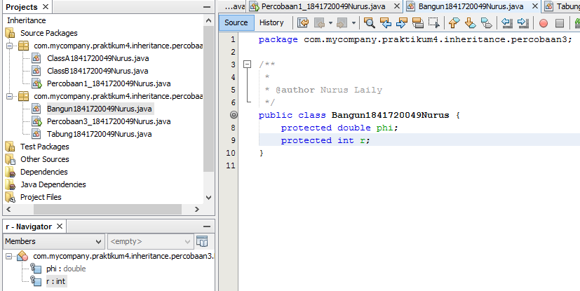
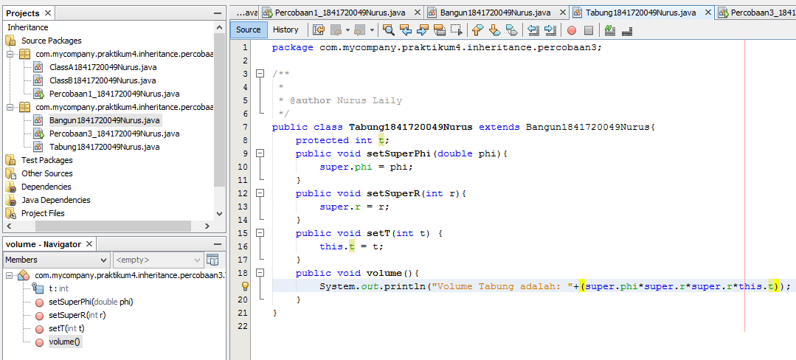

link kode program : 

[ini contoh link ke kode program bangun](../../src/6_Inheritance/Bangun1841720049Nurus.java)

[ini contoh link ke kode program tabung](../../src/6_Inheritance/Tabung1841720049Nurus.java)

[ini contoh link ke kode program main](../../src/6_Inheritance/Percobaan3_1841720049Nurus.java)

### Pertanyaan 

1. Jelaskan	fungsi “super” pada potongan program berikut di class Tabung!
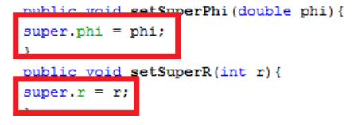

    Jawab : fungsi dari "super" tersebut adalah untuk memanggil atribut parent class/superclass

2. Jelaskan	fungsi “super” dan “this pada potongan program berikut di class Tabung!
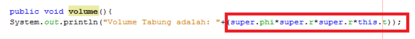
    Jawab : fungsi dari "super" untuk memanggil atribut parent class/superclass dan fungsi dari this digunakan untuk mendeklarasikan object dari class itu sendiri.

3. Jelaskan	mengapa	pada class Tabung tidak dideklarasikan atribut “phi” dan “r” tetapi class tersebut dapat mengakses atribut	tersebut!

    Jawab : dikarenakan sudah terdeklarasikan pada classs sebelumnya dengan menggunakan extends

## Percobaan 4 (Super Consructor)

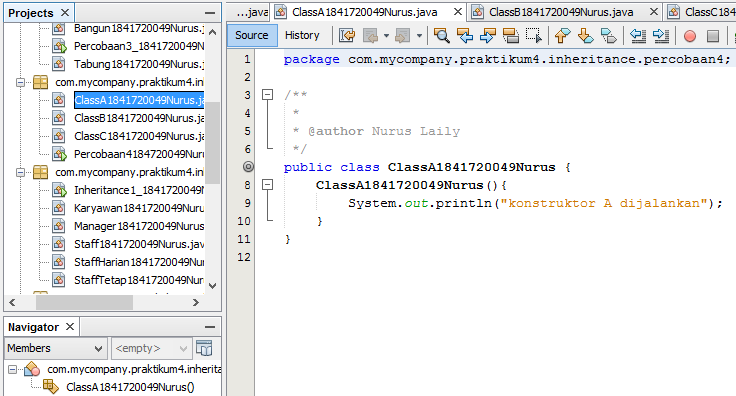
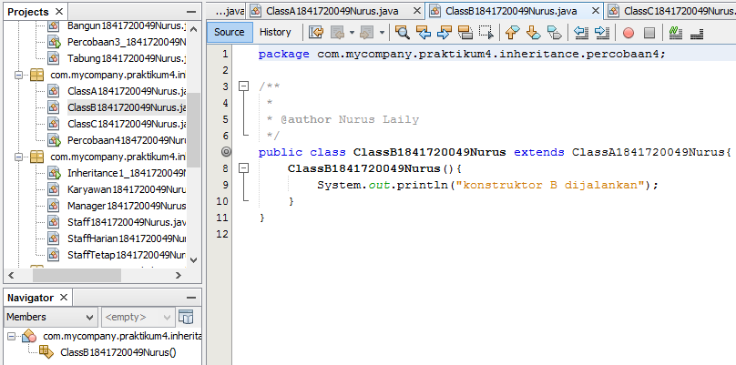
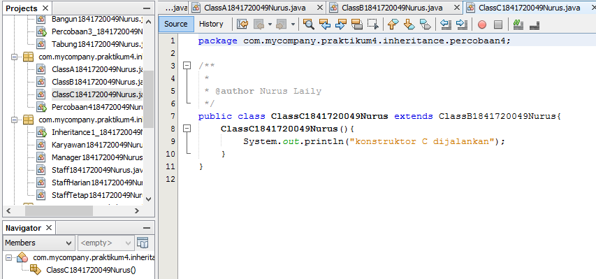
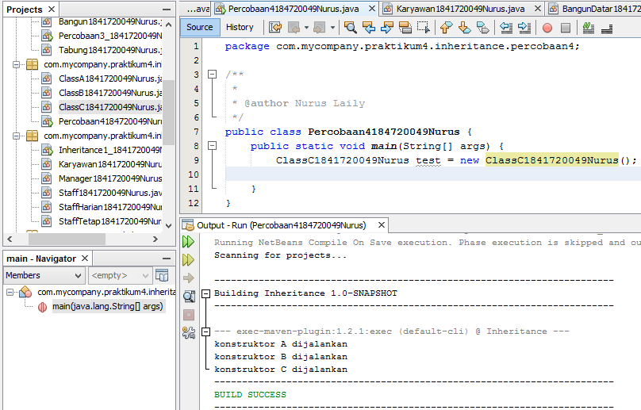

link kode program : 

[ini link ke kode program class A keempat](../../src/6_Inheritance/Percobaan4/ClassA1841720049Nurus.java)

[ini link ke kode program class B keempat](../../src/6_Inheritance/Percobaan4/ClassB1841720049Nurus.java)

[ini link ke kode program class C](../../src/6_Inheritance/Percobaan4/ClassC1841720049Nurus.java)

[ini link ke kode program main](../../src/6_Inheritance/Percobaan4/Percobaan4_1841720049nurus.java)

### Pertanyaan 

1. Pada	percobaan 4	sebutkan mana class	yang termasuk superclass dan subclass, kemudian jelaskan alasannya!

    Jawab : Superclass adalah ClassA1841720049Nurus, subclass 
adalah ClassB1841720049Nurus dan ClassC1841720049Nurus. Karena 
ClassB1841720049Nurus dan ClassC1841720049Nurus terdapat deklarasi extends untuk memanggil Class sebelumnya.

2. Ubahlah isi konstruktor default ClassC seperti berikut:	
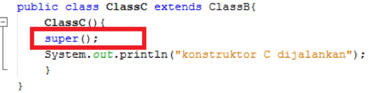
Tambahkan kata super() di baris	Pertama	dalam konstruktor defaultnya. Coba jalankan kembali class Percobaan4 dan terlihat tidak ada perbedaan dari hasil outputnya!

    Jawab : hasilnya outputnya terlihat tidak ada perbedaan

3. Ubahlah isi konstruktor default ClassC seperti berikut:
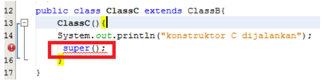
Ketika mengubah	posisi super() dibaris kedua dalam	kontruktor defaultnya dan terlihat ada error. Kemudian kembalikan super()	kebaris	pertama	seperti	sebelumnya maka errornya akan hilang.
Perhatikan hasil keluaran ketika class Percobaan4 dijalankan. Kenapa bisa tampil output seperti berikut pada saat instansiasi	objek test dari	class ClassC
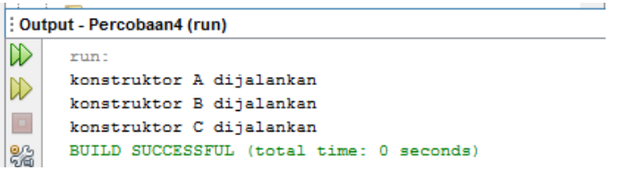
Jelaskan bagaimana urutan proses jalannya konstruktor	saat objek test	dibuat!

    Jawab : karena penggunaan konstruktor super() tersebut hanya bisa digunakan dibaris pertama dalam kontruktor.Urutan konstruktor di awali dari ClassA1841720049Nurus. Source code dari ClassA1841720049Nurus ditampilkan kemudian ClassB1841720049Nurus yang mana kita tambahkan extends untuk memanggil fungsi dari class lain isi dari ClassB1841720049Nurus di tampilkan,  kemudian pada ClassC1841720049Nurus diulangi seperti yang ada di ClassC1841720049Nurus dan diisi dari ClassC1841720049Nurus ditampilkan atau dijalankan. Kemudian Percobaan4_1841720049Nurus (main) di panggil mnggunakan.

4. Apakah fungsi super() pada potongan program	dibawah	ini	di ClassC!

    Jawab : untuk merujuk / memanggil konstruktor parent class / superclass

## Percobaan 5

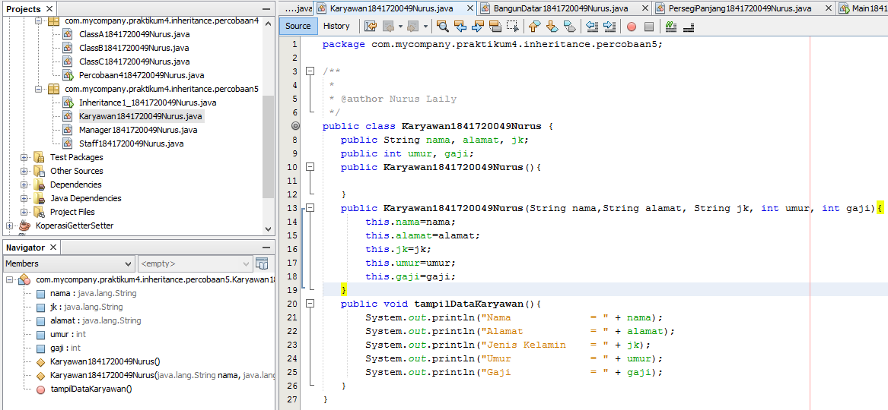
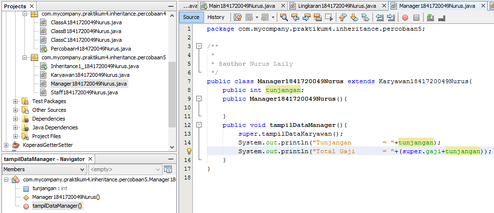
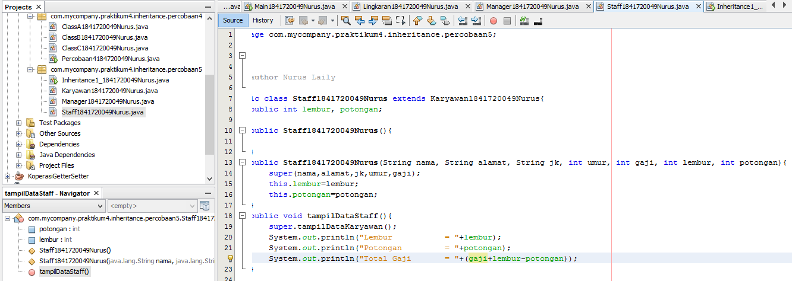
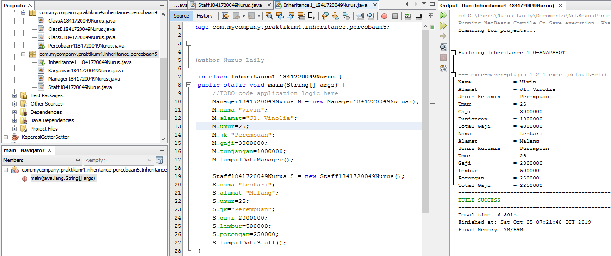

link kode program : 

[ini link ke kode program karyawan](../../src/6_Inheritance/Karyawan1841720049Nurus.java)

[ini link ke kode program manager](../../src/6_Inheritance/Manager1841720049Nurus.java)

[ini link ke kode program staff](../../src/6_Inheritance/Staff1841720049Nurus.java)

[ini link ke kode program main](../../src/6_Inheritance/Percobaan4/Inheritance1_1841720049nurus.java)

### Pertanyaan

1. Sebutkan	class mana yang	termasuk super class dan sub class	dari percobaan 5 diatas!	

    Jawab : Superclass adalah Karyawan1841720049Nurus, dan subclass adalah Staff1841720049Nurus dan Manager1841720049Nurus.

2. Kata	kunci apakah yang digunakan untuk menurunkan suatu class ke class yang lain?

    Jawab : extends

3. Perhatikan kode	program	pada class Manager, atribut apa saja yang dimiliki oleh class tersebut? Sebutkan atribut mana saja yang diwarisi dari	class Karyawan!

    Jawab : Class Manager1841720049Nurus hanya terdapat atribut int tunjangan, atribut gaji pada class Karyawan1841720049Nurus yang mana akan diturunkan dan dioperasikan dengan tunjangan di class Manager1841720049Nurus. 

4. Jelaskan	kata kunci super pada potongan program	dibawah	ini	yang terdapat pada class Manager!
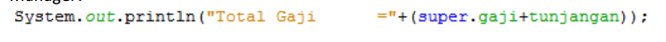
    Jawab : dikarenakan gaji sebelumnya berada pada class karyawan yakni yang paling awal/induknya maka diberi kata kunci super

5. Program pada	percobaan 5	diatas termasuk dalam jenis inheritance apa? Jelaskan alasannya!

    Jawab : termasuk kedalam Multi value Inheritance, yaitu suatu sub class yang menjadi parent class untuk class lainnya.

## Percobaan 6

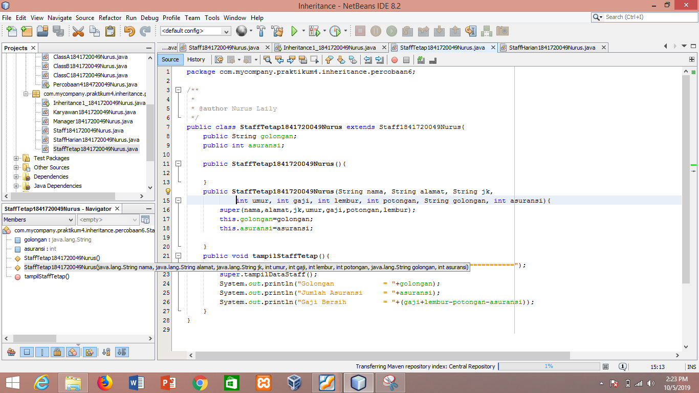
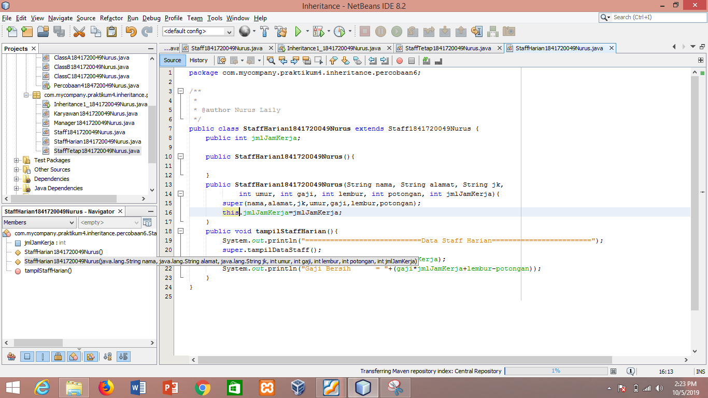
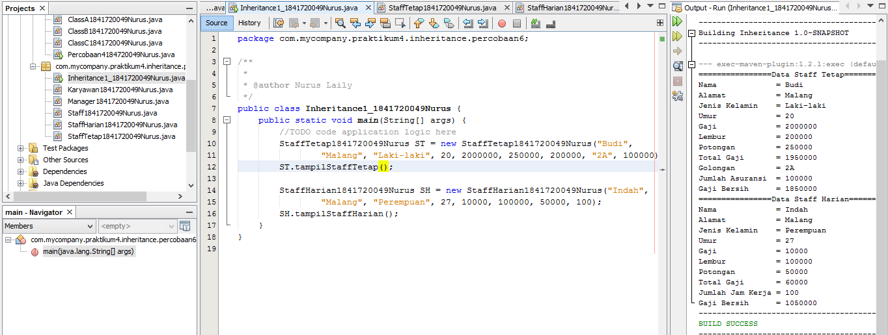

link kode program : 

[ini link ke kode program staff tetap](../../src/6_Inheritance/StaffTetap1841720049Nurus.java)

[ini link ke kode program staff harian](../../src/6_Inheritance/StaffHarian1841720049Nurus.java)

[ini link ke kode program main](../../src/6_Inheritance/Percobaan4/Inheritance1_1841720049nurus.java)

### Pertanyaan

1. Berdasarkan class diatas	manakah yang termasuk single	inheritance	dan	mana yang termasuk multilevel inheritance?

    Jawab : Single Inheritance : Pada Percobaan 1 ClassA (Class B mewakili Class B , Class Tabung mewakili Class Tabung).
    Multilavel inheritance : pada Percobaan4 (Class B,C mewakili Class A, Class Manager, Staff mewakili Class Karyawan,StaffHarian, StaffTetap mewakili Class Staff).

2. Perhatikan kode program class StaffTetap dan StaffHarian,	atribut	apa	saja yang dimiliki oleh class tersebut? Sebutkan atribut mana saja yang diwarisi dari class Staff!

    Jawab : Atribut pada Class StaffHarian adalah atribut jumlah jam kerja. Atribut pada Class StaffTetap adalah golongan dan asuransi. Atribut yang diwarisi pada Class StaffHarian adalah atribut nama,alamat,jk,umur,gaji,lembur,potongan. Atribut yang diwarisi pada Class StaffTetap adalah atribut nama,alamat,jk,umur,gaji,potongan,lembur.

3. Apakah fungsi potongan program berikut pada class StaffHarian
    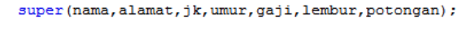
    Jawab : untuk mengambil nilai dari variabel tersebut untuk ditampilkan lagi bersama dengan class tersebut

4. Apakah fungsi potongan program berikut pada class StaffHarian
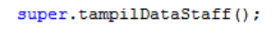

    Jawab :untuk menampilkan data yang terdapat pada class Staff1841720049Nurus

5. Perhatikan kode program dibawah ini yang terdapat pada class StaffTetap
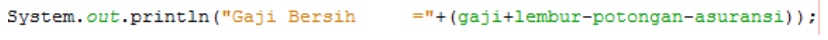
Terlihat dipotongan	program	diatas atribut	gaji, lembur dan potongan dapat diakses	langsung. Kenapa hal ini bisa terjadi	dan	bagaimana class	StaffTetap memiliki atribut gaji, lembur, dan potongan padahal dalam class tersebut tidak dideklarasikan atribut gaji, lembur,dan potongan?

    Jawab : dikarenakan sebelumnya atribut gaji, lembur, dan potongan sudah dipanggil melalui konstruktor dengan menggunakan super yang digunakan untuk memanggil konstruktor berparameter dari	superclass

## Tugas

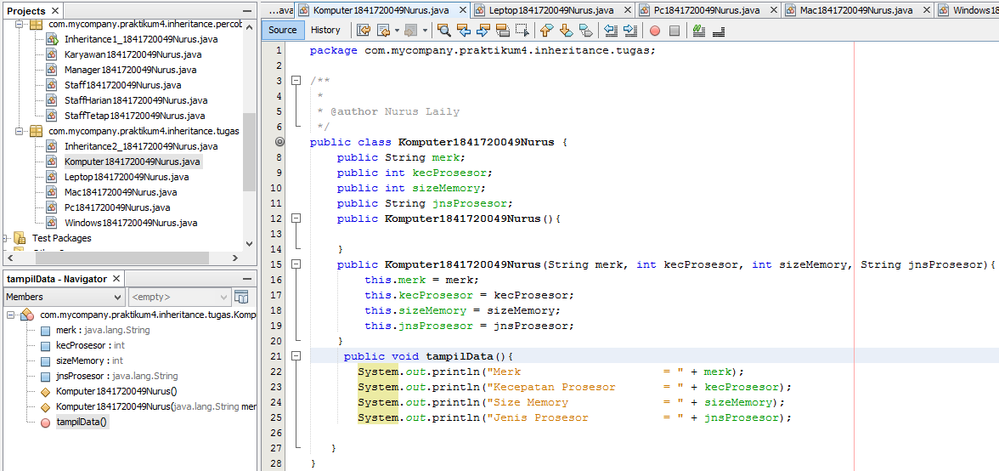
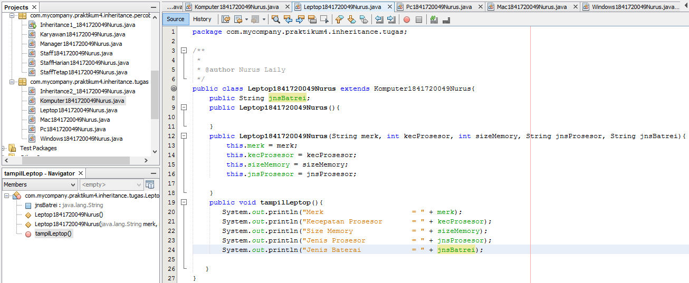
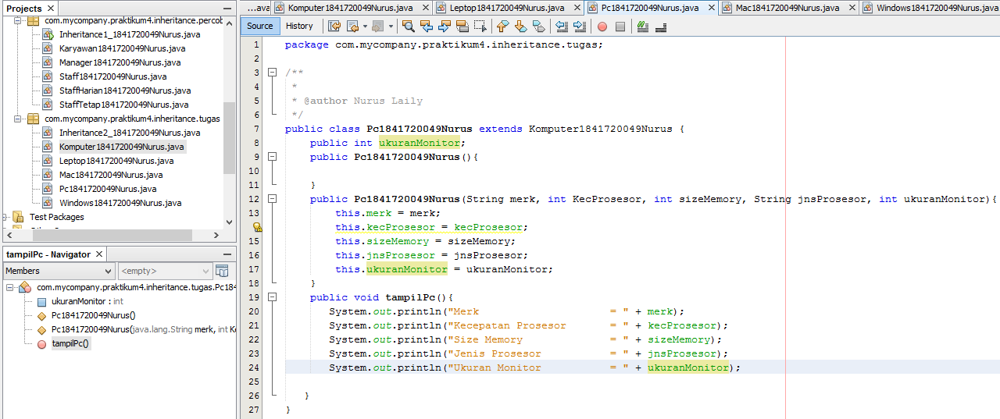
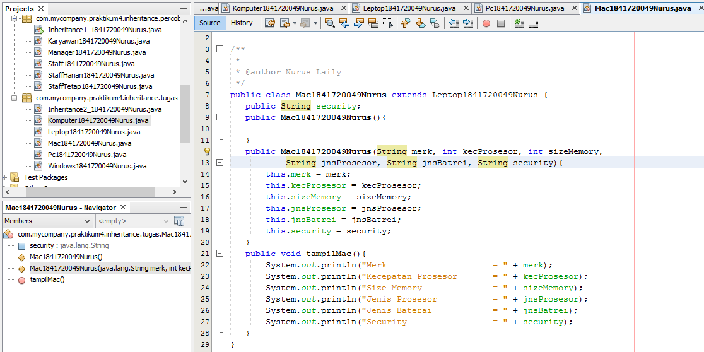
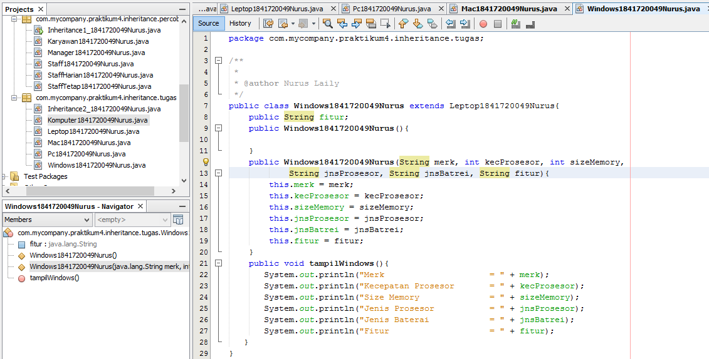
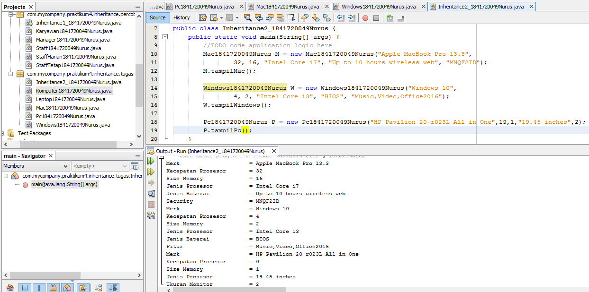

link kode program : 

[ini link ke kode program komputer](../../src/6_Inheritance/Komputer1841720049Nurus.java)

[ini link ke kode program laptop](../../src/6_Inheritance/Leptop1841720049Nurus.java)

[ini link ke kode program pc](../../src/6_Inheritance/Pc1841720049Nurus.java)

[ini link ke kode program mac](../../src/6_Inheritance/Mac1841720049Nurus.java)

[ini link ke kode program windows](../../src/6_Inheritance/Windows1841720049Nurus.java)

[ini link ke kode program main](../../src/6_Inheritance/Percobaan4/Inheritance2_1841720049nurus.java)

## Kesimpulan

Dari praktikum diatas kita dapat mempelajari lebih dalam tentang inheritance. Penggunaan dari extends dan super. Dan menggunakannya dari class mana saja. Kita juga dapat mengetahui apa itu single inheritance dan apa itu multilevel inheritance.

## Pernyataan Diri

Saya menyatakan isi tugas, kode program, dan laporan praktikum ini dibuat oleh saya sendiri. Saya tidak melakukan plagiasi, kecurangan, menyalin/menggandakan milik orang lain.

Jika saya melakukan plagiasi, kecurangan, atau melanggar hak kekayaan intelektual, saya siap untuk mendapat sanksi atau hukuman sesuai peraturan perundang-undangan yang berlaku.

Ttd,

***Nurus Laily Aprillia***