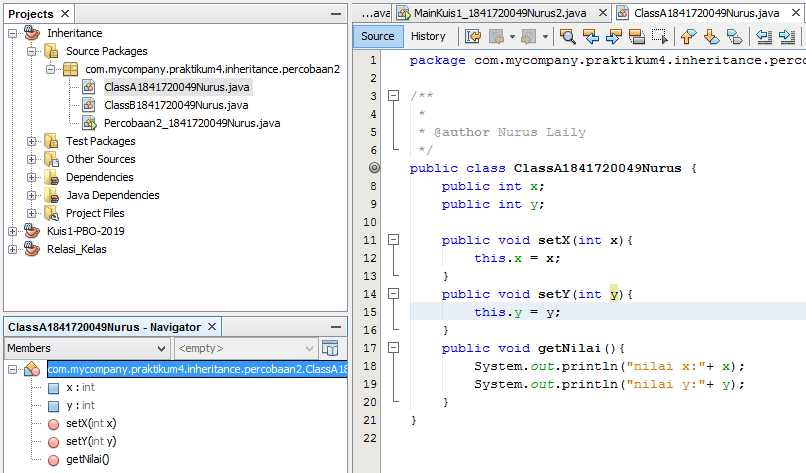
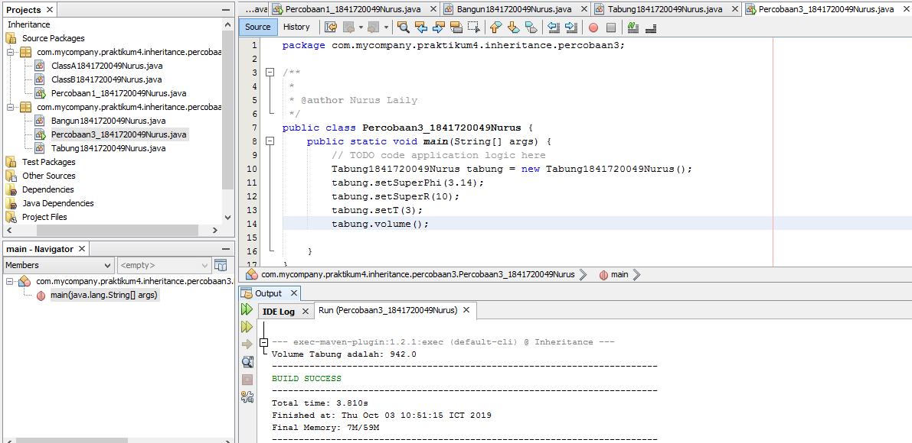

# Laporan Praktikum #4 - Inheritance(Pewarisan)

## Kompetensi

1.  Memahami konsep	dasar inheritance atau pewarisan.
2.  Mampu membuat suatu	subclass dari suatu superclass tertentu.
3.  Mampu mengimplementasikan konsep single dan multilevel inheritance.
4.  Mampu membuat objek	dari suatu subclass dan melakukan pengaksesan terhadap atribut dan method	baik yang dimiliki sendiri atau turunan dari superclass nya.

## Ringkasan Materi

Inheritance	atau pewarisan sifat merupakan suatu cara untuk menurunkan suatu class yang lebih umum menjadi suatu class yang lebih spesifik. Terdapat parent class dan subclass. Cirinya adalah dengan menggunakan extends.

##  PERCOBAAN 1 (Extends)

### TAHAPAN	PERCOBAAN

1. 
2. 
3. 

link kode program : 

[ini link ke kode program class A pertama](../../src/6_Inheritance/ClassA1841720049Nurus.java)

[ini link ke kode program class B pertama](../../src/6_Inheritance/ClassB1841720049Nurus.java)

[ini link ke kode program main](../../src/6_Inheritance/Percobaan1_1841720049Nurus.java)

### Pertanyaan

1. Pada percobaan 1 diatas	program yang dijalankan terjadi error, kemudian perbaiki sehingga program tersebut bisa	dijalankan dan tidak error!

Jawab :

2. Jelaskan	apa	penyebab program pada percobaan 1	ketika dijalankan terdapat error!

Jawab : 

### Percobaan 2 (Hak Akses)

link kode program : 

[ini link ke kode program class A kedua](../../src/6_Inheritance/Percobaan2/ClassA1841720049Nurus.java)

[ini link ke kode program class B kedua](../../src/6_Inheritance/Percobaan2/ClassB1841720049Nurus.java)

[ini link ke kode program main](../../src/6_Inheritance/Percobaan2/Percobaan2_1841720049nurus.java)

### Pertanyaan 

1. Pada	percobaan 2	diatas program yang dijalankan terjadi error, kemudian perbaiki sehingga program tersebut bisa dijalankan dan tidak error!

Jawab : 

2. Jelaskan	apa	penyebab program pada percobaan 1	ketika dijalankan terdapat error!

Jawab:

### Percobaan 3 (Super)

link kode program : 

[ini contoh link ke kode program bangun](../../src/6_Inheritance/Bangun1841720049Nurus.java)

[ini contoh link ke kode program tabung](../../src/6_Inheritance/Tabung1841720049Nurus.java)

[ini contoh link ke kode program main](../../src/6_Inheritance/Percobaan3_1841720049Nurus.java)

### Pertanyaan 

1. Jelaskan	fungsi “super” pada potongan program	berikut	di class Tabung!

Jawab :

2. Jelaskan	fungsi “super” dan “this pada potongan program berikut di	class Tabung!

Jawab :

3. Jelaskan	mengapa	pada class Tabung tidak dideklarasikan atribut “phi” dan “r”tetapi class tersebut dapat	mengakses atribut	tersebut!

Jawab : 

### Percobaan 4 (Super Consructor)

link kode program : 

[ini link ke kode program class A keempat](../../src/6_Inheritance/Percobaan4/ClassA1841720049Nurus.java)

[ini link ke kode program class B keempat](../../src/6_Inheritance/Percobaan4/ClassB1841720049Nurus.java)

[ini link ke kode program class C](../../src/6_Inheritance/Percobaan4/ClassC1841720049Nurus.java)

[ini link ke kode program main](../../src/6_Inheritance/Percobaan4/Percobaan4_1841720049nurus.java)

### Pertanyaan 

1. Pada	percobaan 4	sebutkan mana class	yang termasuk superclass dan subclass, kemudian jelaskan alasannya!

Jawab :

2. Ubahlah isi konstruktor default ClassC seperti	berikut:	
Tambahkan kata super() di baris	Pertama	dalam konstruktor defaultnya. Coba jalankan kembali class Percobaan4 dan terlihat tidak ada perbedaan dari hasil outputnya!

Jawab :

3. Ubahlah isi konstruktor default ClassC seperti	berikut:
Ketika mengubah	posisi super() dibaris kedua dalam	kontruktor defaultnya dan terlihat ada error.	Kemudian kembalikan super()	kebaris	pertama	seperti	sebelumnya maka errornya akan hilang.
Perhatikan hasil keluaran ketika class Percobaan4 dijalankan. Kenapa bisa tampil output seperti berikut pada	saat instansiasi	objek test dari	class ClassC
Jelaskan bagaimana urutan proses jalannya konstruktor	saat objek test	dibuat!

Jawab :

4. Apakah fungsi super() pada potongan program	dibawah	ini	di ClassC!

Jawab :

### Percobaan 5

link kode program : 

[ini link ke kode program karyawan](../../src/6_Inheritance/Karyawan1841720049Nurus.java)

[ini link ke kode program manager](../../src/6_Inheritance/Manager1841720049Nurus.java)

[ini link ke kode program staff](../../src/6_Inheritance/Staff1841720049Nurus.java)

[ini link ke kode program main](../../src/6_Inheritance/Percobaan4/Inheritance1_1841720049nurus.java)

### Pertanyaan

1. Sebutkan	class mana yang	termasuk super class dan sub class	dari percobaan 1 diatas!	

Jawab : 

2. Kata	kunci apakah yang digunakan untuk menurunkan suatu class ke class	yang lain?

Jawab : 

3. Perhatikan kode	program	pada class Manager, atribut apa saja yang dimiliki oleh class tersebut? Sebutkan atribut mana saja yang diwarisi dari	class Karyawan!

Jawab : 

4. Jelaskan	kata kunci super pada potongan program	dibawah	ini	yang terdapat pada class Manager!

Jawab : 

5. Program pada	percobaan 1	diatas termasuk dalam jenis inheritance apa? Jelaskan alasannya!

Jawab :

### Percobaan 6

link kode program : 

[ini link ke kode program staff tetap](../../src/6_Inheritance/StaffTetap1841720049Nurus.java)

[ini link ke kode program staff harian](../../src/6_Inheritance/StaffHarian1841720049Nurus.java)

[ini link ke kode program main](../../src/6_Inheritance/Percobaan4/Inheritance1_1841720049nurus.java)

### Pertanyaan

1. Berdasarkan class diatas	manakah yang termasuk single	inheritance	dan	mana yang termasuk multilevel	inheritance?

Jawab : 

2. Perhatikan kode program class StaffTetap dan StaffHarian,	atribut	apa	saja yang dimiliki oleh class tersebut? Sebutkan atribut mana saja yang diwarisi dari class Staff!

Jawab : 

3. Apakah fungsi potongan program berikut	pada class StaffHarian

Jawab :

4. Apakah fungsi potongan program berikut	pada class StaffHarian

Jawab :

5. Perhatikan kode program dibawah ini yang terdapat pada class StaffTetap
Terlihat dipotongan	program	diatas atribut	gaji, lembur dan potongan dapat diakses	langsung. Kenapa hal ini bisa terjadi	dan	bagaimana class	StaffTetap memiliki atribut gaji, lembur, dan potongan padahal dalam class tersebut tidak dideklarasikan atribut gaji, lembur,dan	potongan?

Jawab : 

## Tugas

link kode program : 

[ini link ke kode program komputer](../../src/6_Inheritance/Komputer1841720049Nurus.java)

[ini link ke kode program laptop](../../src/6_Inheritance/Leptop1841720049Nurus.java)

[ini link ke kode program pc](../../src/6_Inheritance/Pc1841720049Nurus.java)

[ini link ke kode program mac](../../src/6_Inheritance/Mac1841720049Nurus.java)

[ini link ke kode program windows](../../src/6_Inheritance/Windows1841720049Nurus.java)

[ini link ke kode program main](../../src/6_Inheritance/Percobaan4/Inheritance2_1841720049nurus.java)

## Kesimpulan

## Pernyataan Diri

Saya menyatakan isi tugas, kode program, dan laporan praktikum ini dibuat oleh saya sendiri. Saya tidak melakukan plagiasi, kecurangan, menyalin/menggandakan milik orang lain.

Jika saya melakukan plagiasi, kecurangan, atau melanggar hak kekayaan intelektual, saya siap untuk mendapat sanksi atau hukuman sesuai peraturan perundang-undangan yang berlaku.

Ttd,

Nurus Laily Aprillia