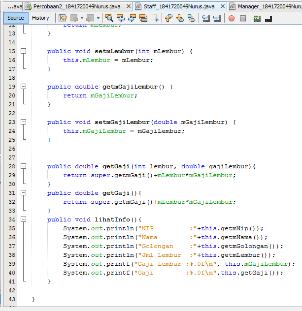
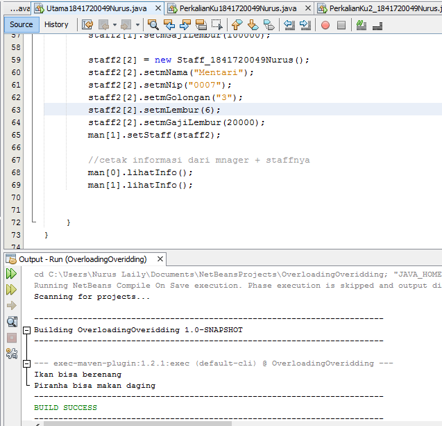

# Laporan Praktikum #7 - OVERLOADING DAN OVERRIDING

## Kompetensi

Setelah menempuh pokok bahasan ini, mahasiswa mampu :
1.  Memahami konsep overloading dan overriding,
2.  Memahami perbedaan overloading dan  overriding,
3.  Ketepatan dalam mengidentifikasi method overriding dan overloading
4.  Ketepatan dalam mempraktekkan instruksi pada jobsheet
5.  Mengimplementasikan method overloading dan  overriding.

## Ringkasan Materi

Overloading adalah menuliskan kembali method dengan nama yang sama pada suatu class. Tujuannya dapat memudahkan penggunaan/pemanggilan method dengan fungsionalitas yang mirip. Overriding adalah Sublass yang berusaha memodifkasi tingkah laku yang diwarisi dari superclass. Tujuannya subclass dapat memiliki tingkah laku yang lebih spesifik sehingga dapat dilakukan dengan cara mendeklarasikan kembali method milik parent class di subclass.

##  Praktikum

### Percobaan 

1. 
2. 
3. 
4. 
5. 
6. 
7. 
8. 
9. 

link kode program : 

[ini link ke kode program Karyawan](../../src/7_Overriding_dan_Overloading/Karyawan_1841720049Nurus.java)

[ini link ke kode program Manager](../../src/7_Overriding_dan_Overloading/Manager_1841720049Nurus.java)

[ini link ke kode program Staff](../../src/7_Overriding_dan_Overloading/Staff_1841720049Nurus.java)

[ini link ke kode program main](../../src/7_Overriding_dan_Overloading/Utama1841720049Nurus.java)

## Latihan

link kode program : 

[ini link ke kode program PerkalianKu](../../src/7_Overriding_dan_Overloading/PerkalianKu1841720049Nurus.java)

1. Dari source coding diatas terletak dimanakah overloading?
    
    Jawab :  dikarenakan terdapat method yang sama dalam satu class

2. Jika terdapat overloading ada berapa jumlah parameter yang berbeda?
    
    Jawab : Terdapat dua parameter yang berbeda. Pada method pertama, terdapat dua parameter. Pada method kedua terdapat 3 parameter. Tetapi dua method tersebut memiliki tipe data yang sama.

[ini link ke kode program PerkalianKu](../../src/7_Overriding_dan_Overloading/PerkalianKu2_1841720049Nurus.java)

3.  Dari source coding diatas terletak dimanakah overloading?

    Jawab : 

4.  Jika terdapat overloading ada berapa tipe parameter yang berbeda?

    Jawab : Terdapat dua parameter yang berbeda. Pada method pertama, terdapat dua parameter. Pada method kedua terdapat 3 parameter. Tetapi dua method tersebut memiliki tipe data yang berbeda.

[ini link ke kode program ikan](../../src/7_Overriding_dan_Overloading/Ikan1841720049Nurus.java)

[ini link ke kode program piranha](../../src/7_Overriding_dan_Overloading/Piranha1841720049Nurus.java)

[ini link ke kode program fish](../../src/7_Overriding_dan_Overloading/Fish1841720049Nurus.java)

5. Dari source coding diatas terletak dimanakah overriding?

    Jawab :  

6. Jabarkanlah apabila sourcoding diatas jika terdapat overriding?

    Jawab : source code yang bermethod sama merupkan overriding

## Tugas

link kode program : 

[ini link ke kode program komputer](../../src/7_Overriding_dan_Overloading/Segitiga1841720049Nurus.java)

[ini link ke kode program laptop](../../src/7_Overriding_dan_Overloading/Manusia1841720049Nurus.java)

[ini link ke kode program pc](../../src/7_Overriding_dan_Overloading/Dosen1841720049Nurus.java)

[ini link ke kode program mac](../../src/7_Overriding_dan_Overloading/Mahasiswa1841720049Nurus.java)

[ini link ke kode program mac](../../src/7_Overriding_dan_Overloading/Testing1841720049Nurus.java)

## Kesimpulan

Dari praktikum diatas kita dapat mempelajari lebih dalam tentang inheritance. Penggunaan dari extends dan super. Dan menggunakannya dari class mana saja. Kita juga dapat mengetahui apa itu single inheritance dan apa itu multilevel inheritance.

## Pernyataan Diri

Saya menyatakan isi tugas, kode program, dan laporan praktikum ini dibuat oleh saya sendiri. Saya tidak melakukan plagiasi, kecurangan, menyalin/menggandakan milik orang lain.

Jika saya melakukan plagiasi, kecurangan, atau melanggar hak kekayaan intelektual, saya siap untuk mendapat sanksi atau hukuman sesuai peraturan perundang-undangan yang berlaku.

Ttd,

***Nurus Laily Aprillia***