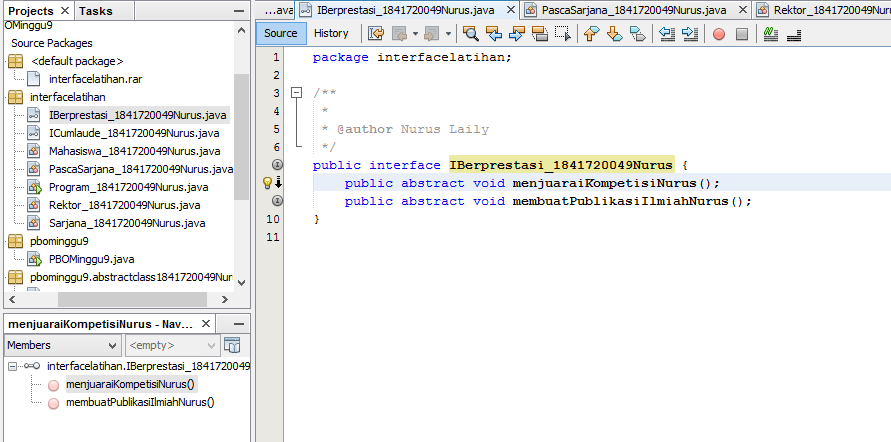
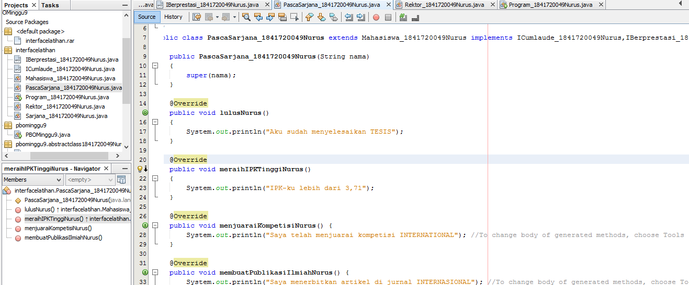

# Laporan Praktikum #9 - Abstract Class dan Interface

## Kompetensi

Setelah menyelesaikan lembar kerja ini mahasiswa diharapkan mampu:
1.  Menjelaskan maksud dan tujuan penggunaan Abstract Class;
2.  Menjelaskan maksud dan tujuan penggunaan Interface;
3.  Menerapkan Abstract Class dan Interface di dalam pembuatan program.

## Ringkasan Materi

Abstract Class  adalah class  yang tidak dapat diinstansiasi namun dapat di-extend.  Abstract class  baru dapat dimanfaatkan ketika ia di-extend. Interface  adalah struktur data yang hanya berisi  abstract methods. Tidak ada apa-apa selain method abstract pada interface, termasuk atribut getter dan setter.
##  Praktikum

### Percobaan 1: Abstract Class

1. 
2. 
3. 
4. 
5. 

link kode program : 

[ini link ke kode program Hewan](../../src/9_Abstract_Class_dan_Interface/src/pbominggu9/abstractclass1841720049Nurus/Hewan_1841720049Nurus.java)

[ini link ke kode program Kucing](../../src/9_Abstract_Class_dan_Interface/src/pbominggu9/abstractclass1841720049Nurus/Kucing_1841720049Nurus.java)

[ini link ke kode program Ikan](../../src/9_Abstract_Class_dan_Interface/src/pbominggu9/abstractclass1841720049Nurus/Ikan_1841720049Nurus.java)

[ini link ke kode program Orang](../../src/9_Abstract_Class_dan_Interface/src/pbominggu9/abstractclass1841720049Nurus/Orang_1841720049Nurus.java)

[ini link ke kode program main](../../src/9_Abstract_Class_dan_Interface/src/pbominggu9/abstractclass1841720049Nurus/Program_1841720049Nurus.java)

Pertanyaan diskusi:
Bolehkah apabila sebuah  class  yang meng-extend  suatu abstract  class  tidak mengimplementasikan method abstract yang ada di class induknya? Buktikan!

Jawab : 

### Percobaan 2: Interface

1. 
2. 
3. 
4. 
5. 
5. 

link kode program : 

[ini link ke kode program Karyawan](../../src/9_Abstract_Class_dan_Interface/Karyawan_1841720049Nurus.java)

[ini link ke kode program Manager](../../src/9_Abstract_Class_dan_Interface/Manager_1841720049Nurus.java)

[ini link ke kode program Staff](../../src/9_Abstract_Class_dan_Interface/Staff_1841720049Nurus.java)

[ini link ke kode program main](../../src/9_Abstract_Class_dan_Interface/Utama1841720049Nurus.java)

Pertanyaan diskusi: 
a.  Mengapa pada langkah nomor 9 terjadi error? Jelaskan!

Jawab : dikarenakan pada class mahasiswa perlu kita implements pula

b.  Dapatkah method  kuliahDiKampus()  dipanggil dari objek  sarjanaCumlaude  di  class Program? Mengapa demikian? 

Jawab : Tidak

c.  Dapatkah  method  kuliahDiKampus()  dipanggil dari parameter  mahasiswa  di method beriSertifikatCumlaude( pada class Rektor? Mengapa demikian?

Jawab : Dapat

d.  Modifikasilah method  beriSertifikatCumlaude() pada  class  Rektor  agar hasil eksekusi class Program menjadi seperti berikut ini: 

Jawab : 

### Percobaan 3: Multiple Interfaces Implementation

1. 
2. 
3. 
4. 
5. 
5. 

link kode program : 

[ini link ke kode program Karyawan](../../src/9_Abstract_Class_dan_Interface/Karyawan_1841720049Nurus.java)

[ini link ke kode program Manager](../../src/9_Abstract_Class_dan_Interface/Manager_1841720049Nurus.java)

[ini link ke kode program Staff](../../src/9_Abstract_Class_dan_Interface/Staff_1841720049Nurus.java)

[ini link ke kode program main](../../src/9_Abstract_Class_dan_Interface/Utama1841720049Nurus.java)

Pertanyaan diskusi:
Apabila Sarjana Berprestasi harus menjuarai kompetisi NASIONAL dan menerbitkan artikel di jurnal NASIONAL, maka modifikasilah  class-class yang terkait pada aplikasi Anda agar di class Program objek pakRektor dapat memberikan sertifikat mawapres pada objek sarjanaCumlaude

Jawab :

## Kesimpulan

## Pernyataan Diri

Saya menyatakan isi tugas, kode program, dan laporan praktikum ini dibuat oleh saya sendiri. Saya tidak melakukan plagiasi, kecurangan, menyalin/menggandakan milik orang lain.

Jika saya melakukan plagiasi, kecurangan, atau melanggar hak kekayaan intelektual, saya siap untuk mendapat sanksi atau hukuman sesuai peraturan perundang-undangan yang berlaku.

Ttd,

***Nurus Laily Aprillia***